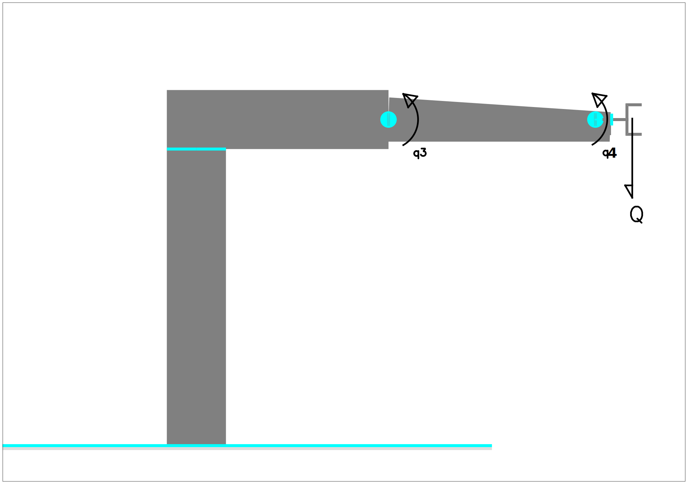
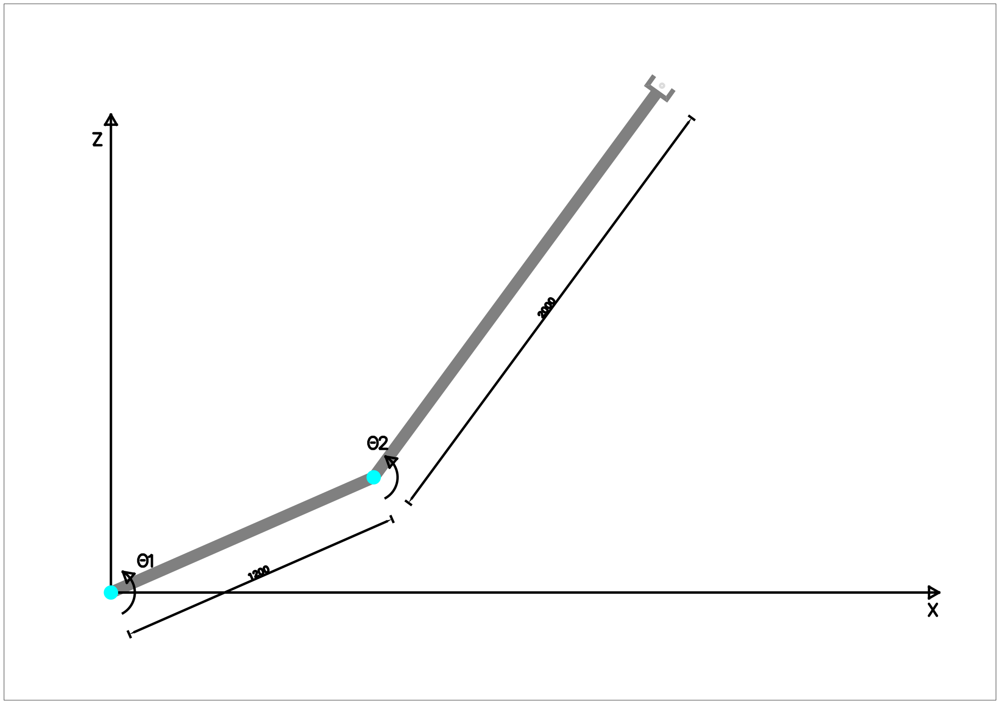

# Morphology

## Problema resuelto 1

The mechanism of the figure consists of a parallelogram transmission moving the joint of a robot.

The distance between the axis of the motor-spindle and the support of the joint remains constant at 250 mm, being the arm that appears to the left of the joint extensible to maintain that distance constant.

The parallelogram is moved by an AC motor with resolver, whose maximum torque is 0.3 N·m.

This motor-spindle assembly offers a reduction ratio of 2000 m-¹ which allows the transformation of the motor's rotation into the translation movement of the spindle, with an efficiency of 80%.

The equations of the resolver are:

 *  $V1 = V\cdot\sin(\omega t)\cdot\sin(\theta_m)$,
 *  $V2 = V\cdot\sin(\omega t)\cdot\cos(\theta _m)$,

being $\theta_m$ the angle in which the motor is located and $V\cdot(\omega t)$ the excitation voltage of the resolver moving coil with $V$=24V. The resolver initial values are set to $V1$=0V , $V2$=0V , $\theta_m$=0 , $\theta_{art}$=0.

 1. Calculate the maximum weight _Q_ that the mechanism can hold at its end.
 2. Obtain the relation between the angle turned by the motor $\theta_m$ and the angle turned by the joint $\theta _{art}$.
 3. If the motor advances in positive direction giving 150 turns with final values in the stop instant of $V1$=11.91V , $V2$=10V. What is the value of $\theta _{art}$ at the stopping point if the zero position is the one drawn?
 4. What would be the range of the joint if the maximum length of the extension arm is 600 mm?

## Solution

### Section 1

The extensible part of the arm is at its minimum length when the arm is in the initial position, so the worst case position will be the initial position shown at the figure below.

In the equilibrium, $T1$ and $T2$ are equal and opposite ($T1 + T2 = 0$) , being:

 *  $T1 = Q \cdot 1,2$
 *  $T2 = F \cdot -0,25$ N·m. (Note that distance is negative in this case).

Therefore:

$
Q \cdot 1,2 -  F \cdot 0,25 =0 ;\quad {F} = {4,8 \cdot Q}
$

On the other hand, the forces in the spindle can be easily determined by an energy balance.

In the ideal situation, the energy transmitted by the motor to the spindle should be the same as that received by the arm. That is, $E_{rot} = E_{lin}$ , and in the general case $\eta \cdot E_{rot} = E_{lin}$, being:

 *  $E_{rot} = M \cdot \theta_m$, where $\theta$ is the angle of rotation in radians.
 *  $E_{lin} = F \cdot d$ , where $d$ is the linear distance traveled by the spindle.

There are two unknowns for $Q$. One is the weight that the robot is capable of _supporting_ at its end, and the other is the weight that it is capable of _moving_.

The first one is solved by the energy balance for the ideal case, since it is a static situation, in which $E_{rot} = E_{lin}$. It is recommended as an exercise.

The second is solved by dividing the two energy equations, taking into account that $ \eta ={ 0.8 } $ :

$
\eta = {E_{lin} \over E_{rot}} ={ {F \cdot d} \over {M \cdot \theta_m} }; \quad F = {\theta \over d} \cdot M \cdot \eta
$

According to the statement, ${\theta \over d}$ = 2000 m-¹. As it is not specified, it is assumed that the transmission is expressed in rad/m.

To solve the section, we substitute the values:

$
F = {\theta \over d} \cdot M \cdot \eta = 2000 \cdot 0.3 \cdot 0.8 = F = 480 N
$

And as $F = 4.8 \cdot Q$, $Q = {F \over 4.8} = {480 \over 4.8} = 100 N \approx 10Kg$.

### Section 2

The spindle transmission has the ratio $\frac{1}{N}={d \over \theta_m} = {1\over2000}$ m/rad. Now the equivalence between $d$ and $\theta_{art}$ is calculated.

According to the figure, the trigonometric equations that relate $d$ to $\theta_{art}$ are

 *  $h\cdot\sin{\theta_{art}} = d$
 *  $h\cdot\cos{\theta_{art}} = 0,25$

Dividing these two equations, it results:

$
\tan{\theta_{art}} = {d \over 0,25} \quad ; \quad
d=0,25 \tan{\theta_{art}};
$

And replacing, it results:

$
{ {\theta_m/2000}\over{0,25}} = {\tan{\theta_{art}}} \quad\rightarrow\quad
{\theta_{art}} = {\arctan {\theta_m \over 500} }
$

### Section 3

Dividing the equations of the resolver results in:

$
{ \frac{V1}{V2}={ {V\cdot\sin(\omega t)\cdot\sin(\theta_m)}\over{
 V\cdot\sin(\omega t)\cdot\cos(\theta _m)} } }\quad;\quad
{ {V1 \over V2} ={ \tan(\theta _m) } }
$

Since only the instantaneous values of $V1$ and $V2$ are known at stop, it is not possible to know a priori if they are in phase with the reference sine wave of the resolver.

It is assumed that they are, so the values of $\sin(\theta_m)$ and $\cos(\theta_m)$ are both positive, which implies that the rotation angle must be in the first quadrant.

Substituting, the current value of $\theta _m$ results:

$
{ {V1 \over V2} ={ \tan(\theta _m) } }= {11.91 \over 10} = {1.191}\quad\rightarrow\quad
{\theta _m} = {\arctan(1.191)}= {0.87 \ rad \approx 50\deg}
$

As there are $150$ turns ($942.48$ rad) already, the value of the final angle is $943.35$ rad

Substituting this value for the above equation results in an angle of :

$
{\theta_{art}} = {\arctan {943.35 \ rad \over 500}} \quad\rightarrow\quad
{\theta_{art}} = {1.08 \ rad = 62.08\deg}
$

### Section 4

Considering that $h\cdot\cos({\theta_{art}}) = 0.25$ (see section 2), and replacing the value of h by 600 mm (0.6 m) results:

$
{\cos(\theta_{art})} = 0,42\quad\rightarrow\quad
\theta_{art} = 1,14 \ rad = 65,38\deg \approx 65\deg
$

This means that the range of the joint is ($-65$ deg,$+65$ deg).
## Problem 2

Given the 5 DOF robot in the figure, calculate:

 *  a) The joint 3 ($q_3$) is moved by an AC Motor - Brake - Harmonic Drive assembly, being the data of the latter: reduction ratio 120:1, efficiency of 93%.
    1. If the maximum static load to be carried by the robot is 80 Newton, what should be the maximum torque (N·m) to be supported by a brake located on the motor axis, applying a safety coefficient of 30%?
    2. If the motor is rotating at 900 rpm, at what speed is the joint rotating?
 *  b) Joint 1 ($q_1$) is moved by an AC Motor - Brake - Resolver - Harmonic Drive - Rack and Pinion Transmission assembly. The Harmonic Drive has a ratio of $175:1$ and an efficiency of 95%. In the rack and pinion drive, the effective radius of the pinion is 0.3 m and its efficiency is 75%. Being $\theta_m$ the angle in which the motor is located and the excitation voltage of the resolver moving coil with $V=24$V.

    1. If we start from $\theta_m$=0 , and the motor advances in positive direction, indicating the resolver 350 steps by zero, giving final values in the stop instant of $V1$=17.32V , $V2$=10V. What is the value of $q_1$ in the stop point?
    2. What will be the linear speed of the joint if the motor turns at 110 rpm?

## Solution

### Section a1

If the maximum load is $Q=80N$, applying a safety coefficient of $30\%$, the considered load results in $P=1.3\cdot80N=104N$.

The worst position for $q_3$ is the one shown in the figure, and corresponds to the angle $q_3=0$ deg and $q_4=90$ deg.

Torque in $q_3$ will be $M_3=P(d+e)$, therefore $M_3 = 104(d+e)$.

To stop the joint by means of the brake, the transmission ratio must be considered, but in brake condition, the gear input is on the side of the joint and the output on the side of the motor. Note that friction losses will help to stop the motor. Dividing the two energy equations, and taking $\eta ={ 0.93 }$, results in:

$
\eta = {E_{o} \over E_{i}} = {E_{m3} \over E_{3}} ={ {M_{m3} \cdot \theta_{m3}} \over {M_{3} \cdot \theta_{3}} } \quad;\quad M_{m3} = { {M_3 \cdot \eta} \cdot {\theta_{3} \over \theta_{m3} }  }
$

To solve, the values are replaced:

$
M_{m3} = { {104(d+e) \cdot 0.93} \cdot {1 \over 120 }  } = {0.806(d+e)} \quad  [\text N\cdot \text m]
$

### Section a2

Using gear transmission ratio $N=120$:

$
N={q_{i} \over q_{o} } = {\dot q_{m3} \over \dot q_{3} } ;\quad
{\dot q_{3}} = {\dot q_{m3}  \over N  }
$

And substituting, the result is:

$
\dot q_{3} = {900\text{[rpm]} \over 120 } = {7,5} \text{[rpm]}
$

### Section b1

Dividing the equations of the resolver results in:

$
{ {V1 \over V2} ={ \tan(\theta _m) } ={17.32 \over 10}}
$

Assuming that the sinusoidal is in positive phase, and substituting, the current value of $\theta _m$ results:

$
{\theta _m} = {\arctan(1,732)}= {1,047 \ rad \approx 60\deg}
$

Since 350 turns have been counted ($2199.11[\text{rad}]$) , the value of the final angle on the motor axis is $q_{m1}=2200.16\text{[rad]}$
The harmonic drive ratio is $175:1$,therefore $N_h=175$, so the final angle on the harmonic output shaft is $q_{h1}={2200.16/175}=12.57 \text{[rad]}$

Now, the rack-and-pinion transmission has an effective pinion radius of 0.3 [m], which means that the transmission ratio is $N_p = \frac{q_{h1}}{d_1}=\frac{1 rad}{0.3 m}= \frac{1}{0.3} \text{[rad/m]}$.

The output shaft of the harmonic drive is applied to the input shaft of the rack-pinion transmission, which means that

$
d_1= \frac{q_{h1}}{N_p}
$

Which means, considering $\frac{1}{N_p} = {0.3} \text{[m/rad]}$, a result of:

$
d_1=0.3\text{[m/rad]} \cdot 12.57[rad]=3.77[m]
$

### Section b2

In a similar way to the previous sections, it can be said that

$
N=N_p \cdot N_h = {175\over0,3}\text{[rad/m]} =\frac{q_{m1}}{d_1},
$

and the same ratio can be used for kinematic variables, as velocities and accelerations, therefore:

$
v_1=\frac{\dot{q}\_{m1}}{N}
$

And replacing the corresponding values, using $\dot{q}\_{m1}=1100 \cdot {2\pi}/{60} = 115.19 \text{[rad/s]} $ the result is

$
v_1={0.3\over175}[m/rad] \cdot 115.19[rad/s]=0.20[m/s]
$

## Problem 3

Consider the 2 DOF $\theta_1$ and $\theta_2$ in the figure, design the actuators and sensors. These are composed, in each axis, by a DC motor with encoder in its axis and a gear. Calculate:

1. The reductions that the reducers must have, if it is known that:
     * The maximum speed of the motors. $\dot\theta_{mi}=6000 \text{[rpm]}$.
     * When moving each motor separately being the other stopped, the maximum speed of the path at the end of the robot. $V_{max}=3000 \text{[mm/sec]}$.
2. The resolution that have to have the encoders of the axes if you want a total positioning accuracy at the end of 0.01 \[mm\] the gears are zero backlash.
3. The maximum weight that can lift the robot in its end in the conditions but unfavorable, if it is known that:
     * The nominal torque $continuous$ of each motor is $T_1=T_2=1$N·m.
     * The coefficient of use of the reducers is of $\eta=80\%$.
     * The motors have no brakes.

## Solution

### Section 1

For both joints, it must be fulfilled that

$
\dot\theta_{mi}N_i=\dot\theta_i
$

On the other hand, the linear velocity at the opposite end of the joint is calculated by the formula of circular motion of the rigid solid $V_p=\dot\theta_i \cdot d $, being $d$ the distance between the center of rotation and the point $p$ inside the solid.

Combining the two equations, the following is obtained:

$
V_p=\dot\theta_{mi}N_i \cdot d
$

Pay attention to the fact that $d$ refers to the distance from the point $i$ to the rotation axis, so a rotation in q1 generates linear velocities in all points of the robot, and in particular $V_1$ and $V_2$.

The worst case for $\theta_1$, coincides with the maximum value of $d$, and this occurs with $\theta_2=0 \rightarrow d=1.2+2=3.2\text{[m]}$, and the speed at the end of the robot, $V_2$. Particularizing the equation for this case would be:

$
{V_2}={\dot\theta_{m1}R_1 \cdot 3,2}
$

Substituting values, and taking into account that $V_2\le V_{max}$ and that $\dot\theta_{m1}=6000 \text{[rpm]}=628.32 \text{[rad/s]}$ results:

$
{V_2}={628,32\text{[rad/s]}R_1\cdot3,2\text{[m]}}\le{3 \text{[m/s]}}
$

$
{R_1}\le{ {3\text{[m/s]}}\over{628,32\text{[rad/s]}3,2\text{[m]}} }={ {1}\over{670,21} }
$

$
{R_1}={ {1}\over{700} }
$

For $\theta_2$, the distance from the farthest point is $d=2\text{[m]}$, and the speed at the end is still $V_2$. Particularizing the equation for this case would be

$
{V_2}={\dot\theta_{m2}R_2 \cdot 2}
$

Substituting values, and taking into account that $V_2\le V_{max}$ and that $\dot\theta_{m2}=6000 \text{[rpm]}=628.32 \text{[rad/s]}$ results:

$
{V_2}={628,32\text{[rad/s]}R_2 \cdot 2\text{[m]}}\le{3 \text{[m/s]}}
$

$
{R_2}\le{ {3\text{[m/s]}}\over{628,32\text{[rad/s]} \cdot 2\text{[m]}} }={ {1}\over{418,88} }
$

$
{R_2}={ {1}\over{500} }
$

### Section 3

To move the joint by means of the motor, the reduction and the performance of the transmission are applied. Dividing the two energy equations, and taking into account that $\eta ={ E \over E_m }={ 0.80 }$ results that:

$
\eta = {E_{1} \over E_{m1}}=
{ {M_1 \cdot \theta_{1}} \over { M_{m1} \cdot \theta_{m1}} } \quad;\quad 
M_{1} = { {M_{m1} \cdot \eta} \cdot {\theta_{m1} \over \theta_{1}} }
$

To solve, the values are replaced:

$
M_{1} = { {1\mathrm{[N \cdot m]} \cdot 0,80} \cdot \frac{700}{1} }=
{560,00\mathrm{[N \cdot m]}}
$

Doing the mechanical calculation, it is demonstrated that the worst case position is the one shown in the following figure:

Therefore the maximum load that the robot can move in the most unfavorable position is calculated as follows:

$
T_1={ P \cdot d } \Rightarrow P=T_1/d
$

And replacing:

$
P=\frac {560,00\mathrm{[N \cdot m]}} {3,2\mathrm{[m]}}=
{175,00\mathrm{[N]} \rightarrow 17,84\mathrm{[Kg]}}
$

## Problem solved 4

The robot in the figure is moved by a motor-encoder-reducer assembly. The motor is AC type, whose maximum torque is 1 \[Nm\], and the maximum speed is 10,000 rpm. The gear is of the Harmonic Drive type with a reduction ratio of 150:1 and efficiency of 90%. The encoder has 100 beads per turn. The distance between the motor shaft and the end of the robot $l$ is 1 ? It is ordered:

     * a) Calculate the maximum weight $Q$ that can take the robot in its end.
     * b) Calculate the linear resolution of the movement in the end of the robot.
     * c) If the motor turns to its maximum speed, to what angular speed [deg/s] is turning the joint?

## Solution

### Section a

The pair requested in the worst case is:

$
T_1=Q \cdot l
$

It must be equal and opposite to the torque exerted by the joint.
Therefore:

$
{ Q = T_1/l }
$

Making an energy balance in the joint:

$
\eta = {E_{1} \over E_{m1}} ={ {T_1 \cdot \theta_1} \over {T_{1m} \cdot \theta_{1m}} }; \quad
T_1 = {\theta_{1m} \over \theta_{1}}  \cdot  T_{1m}  \cdot  \eta
$

And replacing the values, it turns out:

$
T_1 = { {150 \over 1} \cdot  1\mathrm{[N \cdot m]}  \cdot  0,90} = 135 \mathrm{[N \cdot m]}
$

Considering the above:
$
{ Q = T_1/l } =
{135 \mathrm{[N \cdot m]} / 1 \mathrm{[m]}}=
135 \mathrm{[N]}
$

### Apartado b

The linear resolution of the robot corresponds to the minimum  displacement in the manipulator in the most unfavorable situation. In this case, there is not a position better or worse, so any position is valid for the calculation. The setting of $\theta=0$ will be chosen.

The following figure shows why the linear displacement in the manipulator is calculated as follows:

$
{X_p}={ \sin(\theta_{1}) \cdot L }
$

In the case of the joint, the joint is known to have a 150:1 reduction ratio.
The encoder has 100 beads per turn. Since it is not known whether these counts are pulses or changes in the measurement system, it is assumed that they are changes in the sensor. This means that they can be multiplied by four by quadrature of the signal, then $P_e=4 \cdot 100=400\mathrm{[pulses/turn]}$

Then, the minimum turning angle for the engine will be:

$
\theta_{m1p}={6,28\mathrm{[rad]}/400\mathrm{[pulse]} }= { 0,0157 \mathrm{[rad/pulse]} }
$

As it happens that $\theta_{1p}=R_1 \cdot \theta_{m1p}$, it can be said that

$
{X_p}={ \sin(R_1 \cdot \theta_{m1p}) \cdot L }
$

And after replacing values, it results:

$
{X_p}={ \sin(\frac{1}{150} \cdot 0,0157 \mathrm{[rad/pulse]}) \cdot 1\mathrm{[m]} }=
{ 0,0001\mathrm{[m]}=0,1\mathrm{[mm]} }
$

It is proposed as an additional exercise to calculate the displacement for circular movement and compare it with the linear displacement of the manipulator.

### Section c

Knowing the transmission ratio of the gear, it can be said that:

$
{ \frac{\dot\theta_{1}}{\dot\theta_{m1}} }={ R_1 }={ \frac{1}{150} };\quad
{ \dot\theta_{1} }={ \frac{\dot\theta_{m1}}{150} }
$

On the other hand, it is known that

$
{\dot\theta_{m1max}}=10000\mathrm{[rpm]} = 
{ 10000\mathrm{[rev/min]} \cdot \frac{360\mathrm{[\deg/rev]}}{60\mathrm{[s/min]}} }=
{60000\mathrm{[\deg/s]}}
$

Then, replacing, you have to:
$
{ \dot\theta_{1} }={ \frac{60000\mathrm{[\deg/s]}}{150} }=
{400\mathrm{[\deg/s]}}
$

