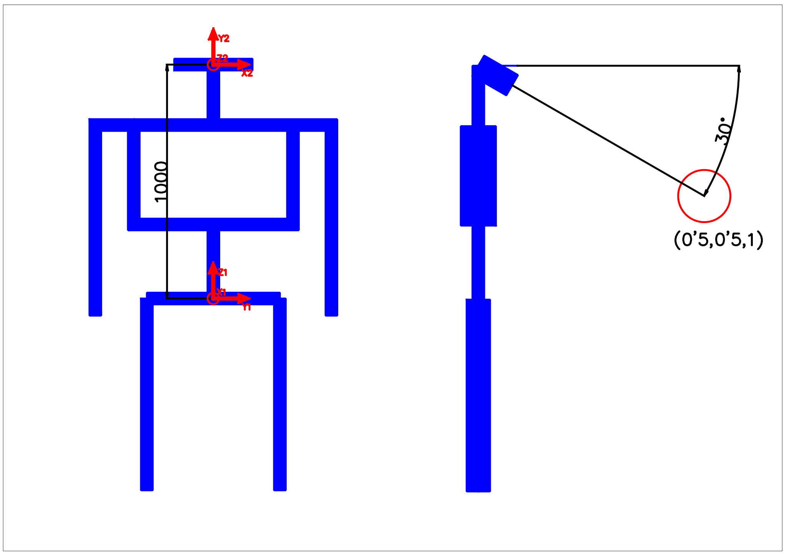

# Herramientas Matemáticas

## Herramientas Matemáticas

## Ejerccios Resueltos

### Ejercicio1

Determinar los ángulos de Euler \(wuw\) asociados al cuaternio $$q=(\frac{\sqrt{2}}{2},0,0,\frac{\sqrt{2}}{2})$$.

#### Solución

Los ángulos intrínsecos de Euler asociados al convencionalismo wuw, corresponden a tres giros en los ejes: z,x,z, por ese orden.

El cuaternio se puede escribir de la siguiente manera:

$$
q=\frac{\sqrt{2}}{2}*(1,0,0,1)
$$

De manera que se puede comparar término a término con una de las definiciones de quaternio, $$q = \sin \frac{\theta}{2}*(1/\tan \frac{\theta}{2},u_x,u_y,u_z)$$. Se puede afirmar entonces que:

* $$\sin \frac{\theta}{2} = \frac{\sqrt{2}}{2}$$.
* $$1/\tan \frac{\theta}{2} = 1$$.
* $$u_x = 0$$.
* $$u_y = 0$$.
* $$u_z = 1$$.

O de otra forma:

$$
\theta = 2*\arcsin{\frac{\sqrt{2}}{2}}
$$

$$
\theta = 2*\arctan(1)
$$

El único ángulo que cumple las dos condiciones es $$\theta = 1,57\mathrm{[rad]} = 90 \mathrm{[deg]}$$.

Así que el cuaternio representa una rotación de 90º alrededor del eje z. El resultado en radianes para esta rotación sería:

$$
{WUW}=(1.57,0,0)
$$

### Ejercicio 2

Expresar el cuaternio asociado a los ángulos de Euler $${WUW} =(0,\pi,0)$$

#### Solución

Para componer las tres rotaciones, se calculan los cuaternios correspondientes, y se multiplican en el orden correcto.

En este caso, aplicando la definición de cuaternio $$Q=(\cos \frac{\theta}{2},sin\frac{\theta}{2} \cdot (e_x,e_y,e_z))$$:

* $$Q_1=(1,0,0,0)$$
* $$Q_2=(0,1,0,0)$$
* $$Q_3=(1,0,0,0)$$

Para concatenar giros se multiplican en el orden correcto:

$$
(Q_1*Q_2)=(1,0,0,0)*(0,1,0,0) = (0,1,0,0)
$$

$$
(Q_1*Q_2)*Q3=(0,1,0,0)*(1,0,0,0) = (0,1,0,0)
$$

Por lo que la rotación se expresa de la siguiente manera:

$$
(0,\pi,0)_{WUW}=(0,1,0,0)_Q
$$

La rotación descrita equivale a un giro de $$\pi \mathrm{[rad]}$$ sobre el eje $$u$$, pero como el giro anterior \($$w$$\) es cero, el eje $$u$$ coincide con el eje $$x$$, así que el giro descrito es de $$\pi \mathrm{[rad]}$$ sobre el eje $$x$$.

Si se compara el resultado con la definición de cuaternio, se observa que:

* $$\cos \frac{\theta}{2}=0 \Rightarrow \frac{\theta}{2}=\frac{\pi}{2},\frac{3\pi}{2}$$
* $$\sin \frac{\theta}{2}=1 \Rightarrow \frac{\theta}{2}=\frac{\pi}{2} \Rightarrow \theta=\pi$$
* $$e=(1,0,0) = e_x$$

### Ejercicio 3

Obtener el cuaternio asociado a

$$
R=
 \begin{pmatrix}
1 & 0 & 0 \\
0 & 1/\sqrt{2} & -1/\sqrt{2} \\
0 & 1/\sqrt{2} & 1/\sqrt{2} \\
\end{pmatrix}
$$

#### Solución

El caso general se resuelve mediante los eigenvalores de la matriz, calculando el eje de giro \(teorema de Euler\), y el ángulo. En éste caso particular, se puede resolver de forma más sencilla, apreciando que la estructura de la matriz corresponde a una rotación elemental alrededor del eje x.

$$
R_x(\alpha) = \begin{pmatrix}
1 & 0 & 0 \\
0 & \cos \alpha &  -\sin \alpha \\
0 & \sin \alpha  &  \cos \alpha \\
\end{pmatrix}=
R=
 \begin{pmatrix}
1 & 0 & 0 \\
0 & 1/\sqrt{2} & -1/\sqrt{2} \\
0 & 1/\sqrt{2} & 1/\sqrt{2} \\
\end{pmatrix}
$$

Si se igualan término a término las dos matrices, se obtiene las siguientes expresiones:

* $$\cos \alpha= 1/\sqrt{2} \quad\Rightarrow \alpha=\pm\pi/4$$
* $$\sin \alpha= 1/\sqrt{2}\quad\Rightarrow \alpha=\pi/4$$

Así que se trata de una rotación de 45º sobre el eje x: $$\theta=\pi/4$$, $$e=(1,0,0)$$. Sustituyendo en la definición de cuaternio, resulta:

$$
Q=(\cos\pi/8,\sin\pi/8*(1,0,0))=(0'92,0'38,0,0)
$$

### Ejercicio 6

$$O_{xyz}$$ se transforma 30º sobre Z, seguido de un desplazamiento unidad a lo largo del nuevo eje x \(u\). Encontrar las ecuaciones que relacionen las coordenadas de un punto en ambos sistemas de coordenadas.

#### Solución

La representación de esta transformación se muestra en la siguiente figura.


Lo que se busca es la transformación del origen de coordenadas $$^{xyz}T_{uvw}$$ de manera que:

$$
^{xyz}p=^{xyz}T_{uvw} \cdot ^{uvw}p
$$

Las transformaciones intrínsecas se pueden encadenar, de manera que la transformación T se puede escribir como:

$$
^{xyz}T_{uvw}=^{xyz}R_{aux} \cdot ^{aux}D_{uvw}
$$

Siendo $$aux$$ un sistema de coordenadas intermedio en el que ya se ha rotado el nuevo eje, pero todavía no se ha desplazado.  
Así, podemos descomponer la transformación en dos transformaciones mas simples, de solo rotación y solo traslación.

Por otro lado, utilizando matrices homogéneas, se pueden escribir $$R$$ y $$D$$ de la siguiente manera:

$$
^{xyz}R_{uvw}=
 \begin{pmatrix}
\cos \gamma & -\sin \gamma & 0 & 0 \\
\sin \gamma & \cos \gamma & 0 & 0 \\
0 & 0 & 1 & 0 \\
0 & 0 & 0 & 1
\end{pmatrix}
$$

$$
^{uvw}D_{uvw}=
\left( \begin{matrix}
1 & 0 & 0 & l \\
0 & 1 & 0 & 0 \\
0 & 0 & 1 & 0 \\
0 & 0 & 0 & 1
\end{matrix} \right)
$$

Sustituyendo los valores de $$l=1$$, $$\gamma=30\deg$$ y multiplicando resulta:

$$
^{xyz}T_{uvw}=
\left( \begin{matrix}
0,87& -0,50& 0& 0& \\
0,50& 0,87& 0& 0& \\
0& 0& 1& 0& \\
0& 0& 0& 1&
\end{matrix} \right)
\times
\left( \begin{matrix}
1 & 0 & 0 & 1,00 \\
0 & 1 & 0 & 0 \\
0 & 0 & 1 & 0 \\
0 & 0 & 0 & 1
\end{matrix} \right)
=
\left( \begin{matrix}
0,87&    -0,50&    0&    0,87& \\
0,50&    0,87&    0&    0,50& \\
0&    0&    1&    0& \\
0&    0&    0&    1& \\
\end{matrix} \right)
$$

### Ejercicio 8

Un sistema de cámaras montado sobre un robot, detecta el centroide de un objeto. La posición detectada es $$(\frac{1}{2},\frac{1}{2},1)$$ respecto de la cámara, pero para manipular dicho objeto, se necesita conocer su posición respecto del robot. Calcular la posición del objeto respecto de la base del robot si se sabe que la cámara está en la posición $$(1,0,0)$$ respecto de la base, y apunta 30º hacia abajo. Todas las distancias están en metros. Los orígenes de coordenadas de la cámara y el robot se muestran en la figura.



#### Solución

Lo primero es describir la transformación completa con transformaciones simples.

Primero se calculará $$^{S1}T_{S2}$$, esto es, la transformación desde el sistema $$S_1$$ al sistema $$S_2$$ sin el giro de la base de la cámara, que se aplicará después como $$^{S2}T_{S2'}$$

Para el cálculo, $$^{S1}T_{S2}$$ se descompone en los siguientes pasos: 1. Rotación: 90º en U \(el eje X\) 2. Rotación: 90º en W \(el nuevo eje Y\) 3. Traslación: \(0,1,0\)

Conviene destacar que la traslación sería diferente si tuviera otra posición en la lista. En general, la transformación resultante siempre depende de del orden de las transformaciones elementales.

La siguiente figura muestra los pasos de manera gráfica.


En el caso general, se puede calcular una matriz homogénea para cada paso, pero también se pueden combinar varios pasos para formar una matriz homogénea por medio de submatrices, como se describe a continuación.

$$
R=R_x(\pi/2)\times R_y(\pi/2) =
\begin{pmatrix}
1 & 0 & 0 \\
0 & 0 & -1 \\
0 & 1 & 0\\
\end{pmatrix}
\times
\begin{pmatrix}
0 & 0 & 1 \\
0 & 1 & 0 \\
-1 & 0 & 0 \\
\end{pmatrix}
=\begin{pmatrix}
0 & 0 & 1\\
1 & 0 & 0\\
0 & 1 & 0\\
\end{pmatrix}
$$

De manera que los pasos 1 y 2 se describen mediante la matriz homogénea:

$$
^{S1}R_{2}=
 \begin{pmatrix}
0 & 0 & 1 & 0 \\
1 & 0 & 0 & 0 \\
0 & 1 & 0 & 0 \\
0 & 0 & 0 & 1
\end{pmatrix}
$$

Y la traslación, el paso 3, se describe mediante:

$$
^{2}L_{S2}=
\begin{pmatrix}
1 & 0 & 0 & 0 \\
0 & 1 & 0 & 1 \\
0 & 0 & 1 & 0 \\
0 & 0 & 0 & 1
\end{pmatrix}
$$

Para calcular la transformación completa se multiplican en el orden correcto

$$
^{S1}T_{S2}=^{S1}R_{2}\times^{2}L_{S2}
$$

Y el resultado es:

$$
\begin{pmatrix}
0 & 0 & 1 & 0 \\
1 & 0 & 0 & 0 \\
0 & 1 & 0 & 0 \\
0 & 0 & 0 & 1
\end{pmatrix}
\times
\begin{pmatrix}
1 & 0 & 0 & 0 \\
0 & 1 & 0 & 1 \\
0 & 0 & 1 & 0 \\
0 & 0 & 0 & 1
\end{pmatrix} 
=
\begin{pmatrix}
0 & 0 & 1 & 0\\
1 & 0 & 0 & 0\\
0 & 1 & 0 & 1\\
0 & 0 & 0 & 1\\
\end{pmatrix} 
=^{S1}T_{S2}
$$

Como curiosidad, se comenta que la matriz resultante equivale a una traslación seguida de dos rotaciones, de la siguiente manera: 1. Traslación: \(0,0,1\) 2. Rotación: 90º en U \(el eje X\) 3. Rotación: 90º en W \(el nuevo eje Y\)

Esto significa que se podría haber formado la matriz completa por partes y se habría evitado la última multiplicación.

Para considerar el giro de 30º sobre el eje X del sistema de cámaras, se utiliza la matriz homogénea $$^{S2}T_{S2'}$$, o lo que significa, la transformación desde $$S2$$ a $$S2'$$.  
Como se trata de una rotación elemental alrededor del eje X de $$S2$$, la matriz de rotación es la siguiente:

$$
R_x(\alpha) = \begin{pmatrix}
1 & 0 & 0 \\
0 & \cos \alpha &  -\sin \alpha \\
0 & \sin \alpha  &  \cos \alpha \\
\end{pmatrix}
=
\begin{pmatrix}
1 & 0 & 0 \\
0 & \sqrt{3}/2 &  -1/2 \\
0 & 1/2  & \sqrt{3}/2 \\
\end{pmatrix}
$$

Y la matriz de transformación:

$$
^{S2}T_{S2'}=\begin{pmatrix}
1 & 0 & 0 & 0\\
0 & \sqrt{3}/2 &  -1/2 & 0\\
0 & 1/2  & \sqrt{3}/2  & 0\\
0 & 0 & 0 & 1\\
\end{pmatrix}
$$

Combinando las dos transformaciones, resulta:

$$
^{S1}T_{S2'}=^{S1}T_{S2} \times ^{S2}T_{S2'}=
\begin{pmatrix}
0 & 0 & 1 & 0\\
1 & 0 & 0 & 0\\
0 & 1 & 0 & 1\\
0 & 0 & 0 & 1\\
\end{pmatrix} 
\times
\begin{pmatrix}
1 & 0 & 0 & 0\\
0 & \sqrt{3}/2 &  -1/2 & 0\\
0 & 1/2  & \sqrt{3}/2  & 0\\
0 & 0 & 0 & 1\\
\end{pmatrix}
$$

$$
^{S1}T_{S2'}=
\begin{pmatrix}
0 & 1/2 & \sqrt{3}/2 & 0\\
1 & 0 & 0 & 0\\
0 & \sqrt{3}/2 & -1/2 & 1\\
0 & 0 & 0 & 1\\
\end{pmatrix}
$$

Y finalmente, para calcular la posición del centroide respecto de la base, tan solo hay que aplicar la transformación al punto $$^{S2'}p=(\frac{1}{2},\frac{1}{2},1)$$:

$$
^{S1}p= ^{S1}T_{S2'} \times ^{S2'}p
$$

Sustituyendo valores resulta:

$$
^{S1}p=\begin{pmatrix}
0 & 1/2 & \sqrt{3}/2 & 0\\
1 & 0 & 0 & 0\\
0 & \sqrt{3}/2 & -1/2 & 1\\
0 & 0 & 0 & 1\\
\end{pmatrix} 
\times
\begin{pmatrix}
\frac{1}{2}\\
\frac{1}{2}\\
1\\
1\\
\end{pmatrix}
=
(1'12,0'50,0'93,1)
$$

### Ejercicio 9

Un robot de 6 grados de libertad debe coger una pieza que se encuentra sobre una mesa. La posición y orientación de la pieza es conocida desde el sistema de coordenadas de la mesa, pero para programar el robot, se necesita la posición y orientación de la pieza respecto de la base del robot. Los sistemas de referencia se detallan en la figura. Calcular el "target" necesario para la programación del robot tanto en posición como en orientación.  
Las distancias de la figura están en milímetros.

Vista superior:  Vista lateral: 

#### Solución

Lo primero es describir la transformación completa con transformaciones simples.

El dato solicitado se puede calcular mediante la tranformación desde el sistema de coordenadas $$S0$$ en la base del robot hasta el sistema de coordenadas anclado al objetivo $$S2$$ que se muestra en la vista superior.  
En concreto lo que se busca es la transformación $$^{S0}T_{S2}$$, que se puede descomponer en:

$$
^{S0}T_{S2}=^{S0}T_{S1}*^{S1}T_{S2}
$$

Para el cálculo, $$^{S0}T_{S1}$$ se descompone en los siguientes pasos: 1. Traslación: \(1,1,0.825\) 2. Rotación: -90º en Z

$$^{S1}T_{S2}$$ se descompone en los siguientes pasos: 1. Traslación: \(1,1,0\) 2. Rotación: 30º en Z

Para $$^{S0}T_{S1}$$ los pasos 1 y 2 se describen mediante la matriz homogénea formada por el vector de traslación y una matriz de rotación elemental en Z:

$$
^{S0}T_{S1}=
 \begin{pmatrix}
\cos \theta_1 & -\sin \theta_1 & 0 & t_{x1} \\
\sin \theta_1 & \cos \theta_1 & 0 & t_{y1} \\
0 & 0 & 1 & t_{z1} \\
0 & 0 & 0 & 1
\end{pmatrix}=
 \begin{pmatrix}
 0 & 1 & 0 & 1\\
-1 & 0 & 0 & 1\\
0 & 0 & 1 & 0,825\\
0 & 0 & 0 & 1\\
\end{pmatrix}
$$

Los dos pasos se integran en una sola matriz, ya que la traslación se aplica **antes** de la rotación.

Para $$^{S1}T_{S2}$$ la matriz homogénea es la siguiente:

$$
^{S1}T_{S2}=
 \begin{pmatrix}
\cos \theta_2 & -\sin \theta_2 & 0 & t_{x2} \\
\sin \theta_2 & \cos \theta_2 & 0 & t_{y2} \\
0 & 0 & 1 & t_{z2} \\
0 & 0 & 0 & 1
\end{pmatrix}=
 \begin{pmatrix}
0,87 & -0,5 & 0 & 0,5\\
0,5 & 0,87 & 0 & 0,5\\
0 & 0 & 1 & 0\\
0 & 0 & 0 & 1\\
\end{pmatrix}
$$

Para calcular la transformación completa se multiplican en el orden correcto

$$
^{S0}T_{S2}=^{S0}T_{S1}*^{S1}T_{S2}
$$

Y el resultado es:

$$
\begin{pmatrix}
 0 & 1 & 0 & 1\\
-1 & 0 & 0 & 1\\
0 & 0 & 1 & 0,825\\
0 & 0 & 0 & 1\\
\end{pmatrix}
\times
 \begin{pmatrix}
0,87 & -0,5 & 0 & 0,5\\
0,5 & 0,87 & 0 & 0,5\\
0 & 0 & 1 & 0\\
0 & 0 & 0 & 1\\
\end{pmatrix}
=
\begin{pmatrix}
0,50 & 0,87 & 0 & 1,5\\
-0,87 & 0,50 & 0 & 0,5\\
0 & 0 & 1 & 0,825\\
0 & 0 & 0 & 1\\
\end{pmatrix} 
=^{S0}T_{S2}
$$

Comparando el resultado con la definición de matriz homogénea y la de giro elemental en Z, se puede observar que se trata de una traslación $$(1'5,0'5,0'825)$$ , seguida de una rotación de $$\theta=-60 \deg$$.

En lenguaje Rapid, este dato corresponde a un tipo target, y se definiría de la siguiente manera:

```text
CONST robtarget objetivo := [[1.5,0.5,0.825],[0.866,0,0,-0.5],[0,0,0,0],[9E+09,9E+09,9E+09,9E+09,9E+09,9E+09]];
```

Hay que recordar que el cuaternio asociado al giro de -60 grados alrededor del eje Z se corresponde con:

$$
Q=(\cos \frac{\theta}{2},sin\frac{\theta}{2} \cdot (e_x,e_y,e_z))=
(0'866,-0'5*(0,0,1))=
(0'866,0,0,-0'5)
$$

## Ejercicios Propuestos

### Propuesto 1

Se dispone de una trayectoria definida mediante dos sistemas de coordenadas $$S_1$$ y $$S_2$$. Estos sistemas definen la posición y orientación del manipulador del robot respecto de la base $$(S_0)$$. Hallar un sistema coordenado intermedio \(a medio camino en distancia y ángulo\) respecto de la base. Los datos son los siguientes \(posición en metros, rotación en cuaternios\):

| Sistema | Posición | Rotación |
| :--- | :--- | :--- |
| $$^0S_1$$ | $$(1,1,1)$$ | $$(1,0,0,0)$$ |
| $$^0S_2$$ | $$(1,-1,1)$$ | $$(0,0,1,0)$$ |

### Soluciones a los ejercicios propuestos

Propuesto 1: $$^0S_m$$ : Pos: $$(1,0,1)$$ Rot: $$(0.7071,0,0.7071,0)$$

Fin del capítulo

