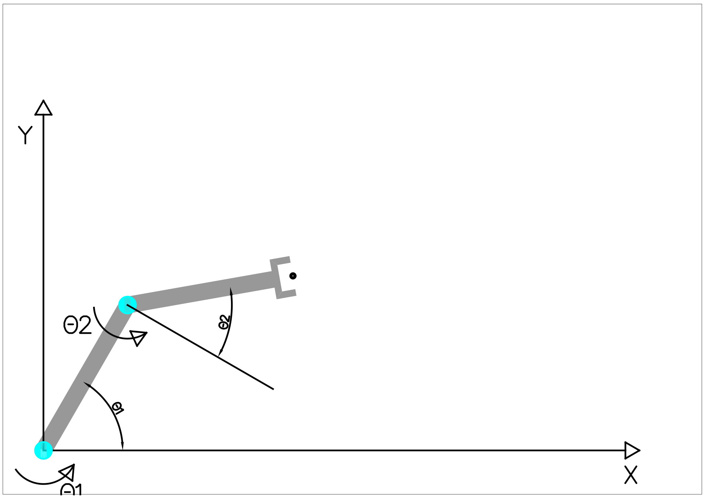
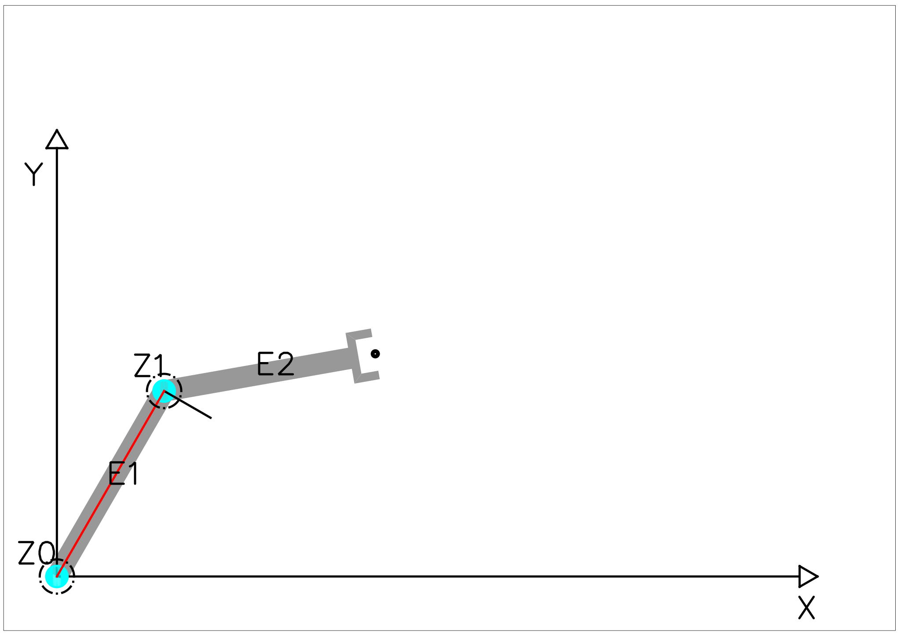
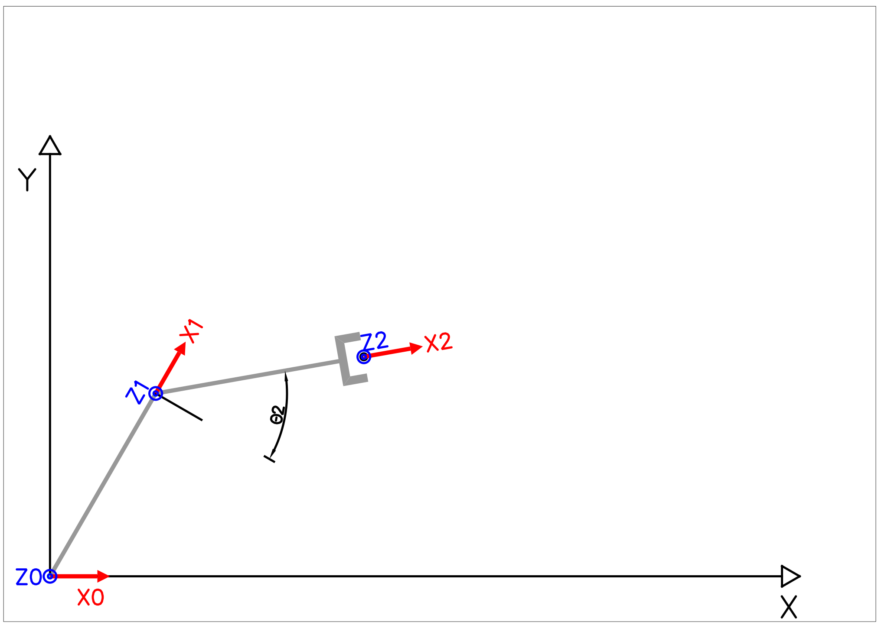
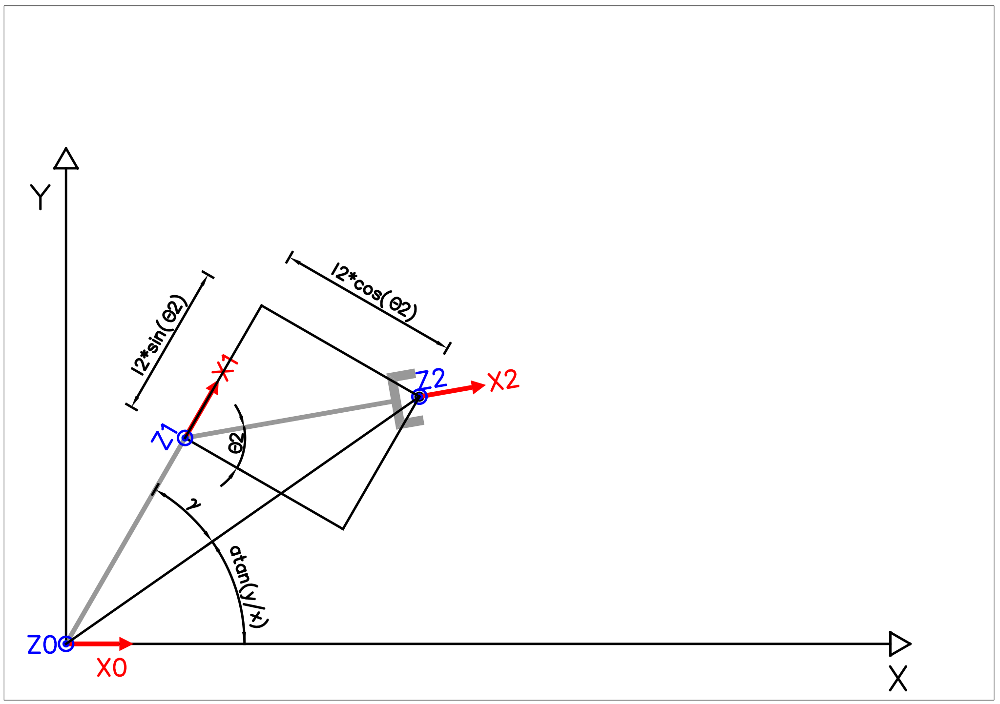
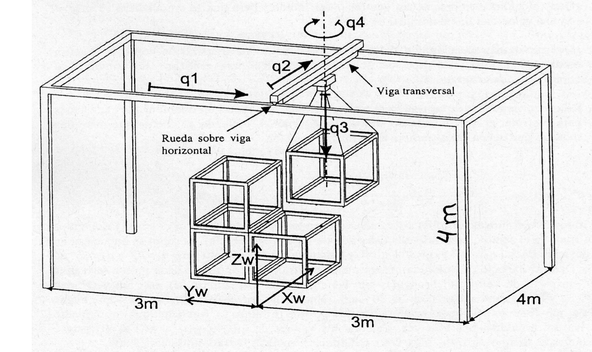

# Cinemática D. Directa

## Problema 1

Hallar la cinemática diferencial para el manipulador plano de dos grados de libertad mostrado en la figura. La longitud de cada eslabón es de 500 mm, y son todos iguales.

Para el robot de la figura, se pide: 1. Parámetros de Denavit-Hartenberg. 2. Obtener la matriz de la transformada cinemática directa. 3. Resolver el problema cinemático inverso. 4. Obtener el modelo cinemático diferencial. 5. Determinar mediante la matriz Jacobiana si existen puntos singulares para el robot.

### Solución

Aplicando el algoritmo DH, obtenemos los siguientes resultados:

* Pasos 1 a 6: Se sitúan los dos eslabones \(E1,E2\) y dos ejes de giro \(Z0,Z1\). Las normales comunes a los ejes se marcan en rojo.

* Pasos 7 a 9: Se sitúan los sistemas de coordenadas solidarios a cada eslabón \(S1,S2,S3\). El origen de coordenadas de la base se sitúa en S0.

* Pasos 10 a 13: En base a la figura anterior se construye la tabla de parámetros.

|  | $$\theta_i$$ | $$d_i$$ | $$a_i$$ | $$\alpha_i$$ |
| :--- | :--- | :--- | :--- | :--- |
| 0:i=1 | $$\color{brown}{\theta_1}$$ | 0 | $$l_1$$ | 0 |
| 1:i=2 | $$-90+\color{brown}{\theta_2}$$ | 0 | $$l_2$$ | 0 |

* Paso 14

Las matrices de transformación $$^{i-1}A_{i}$$ son:

$$
{^{0}A_{1}}=
\begin{pmatrix}\cos( {\theta_{1}})  & -\sin( {\theta_{1}})  & 0 & {l_{1}}\cdot \cos( {\theta_{1}}) \\
 \sin( {\theta_{1}})  & \cos( {\theta_{1}})  & 0 & {l_{1}}\cdot \sin( {\theta_{1}}) \\
 0 & 0 & 1 & 0\\
 0 & 0 & 0 & 1\end{pmatrix}
$$

$$
{^{1}A_{2}}=
\begin{pmatrix}\cos{( {\theta_{2}}-\frac{\pi}{2}) } &
-\sin{( {\theta_{2}}-\frac{\pi}{2}) } & 
0 & 
{l_{2}}\,\cos{( {\theta_{2}}-\frac{\pi}{2}) }\\
\sin{( {\theta_{2}}-\frac{\pi}{2}) } & \cos{( {\theta_{2}}-\frac{\pi}{2}) } & 0 & {l_{2}}\,\sin{( {\theta_{2}}-\frac{\pi}{2}) }\\
0 & 0 & 1 & 0\\
0 & 0 & 0 & 1\end{pmatrix}
$$

Si se simplifica $${^{1}A_{2}}$$ mediante las identidades $$\sin(\alpha-\frac{\pi}{2}) = -\cos(\alpha)$$ y $$\cos(\alpha-\frac{\pi}{2}) = \sin(\alpha)$$, el resultado será:

$$
{^{1}A_{2}}=
\begin{pmatrix}\sin{( {\theta_{2}}) } & \cos{( {\theta_{2}}) } & 0 & {l_{2}}\,\sin{( {\theta_{2}}) }\\
-\cos{( {\theta_{2}}) } & \sin{( {\theta_{2}}) } & 0 & -{l_{2}}\,\cos{( {\theta_{2}}) }\\
0 & 0 & 1 & 0\\
0 & 0 & 0 & 1\end{pmatrix}
$$

* Paso 15

Multiplicando las matrices resulta la transformación entre la base y el extremo.

$$
T=^{0}A_{1}*^{1}A_{2}
$$

$$
T=
\begin{pmatrix}\sin{( {\theta_{2}}+{\theta_{1}}) } & \cos{( {\theta_{2}}+{\theta_{1}}) } & 0 & {l_{2}}\,\sin{( {\theta_{2}}+{\theta_{1}}) }+{l_{1}}\,\cos{( {\theta_{1}}) }\\
-\cos{( {\theta_{2}}+{\theta_{1}}) } & \sin{( {\theta_{2}}+{\theta_{1}}) } & 0 & {l_{1}}\,\sin{( {\theta_{1}}) }-{l_{2}}\,\cos{( {\theta_{2}}+{\theta_{1}}) }\\
0 & 0 & 1 & 0\\
0 & 0 & 0 & 1\end{pmatrix}
$$

Por lo tanto, siendo p=\(x,y\) el centro del manipulador \(tip\), se puede afirmar que:

* $$x={l_{2}}\,\sin{( {\theta_{2}}+{\theta_{1}}) }+{l_{1}}\,\cos{( {\theta_{1}}) }$$
* $$y={l_{1}}\,\sin{( {\theta_{1}}) }-{l_{2}}\,\cos{( {\theta_{2}}+{\theta_{1}}) }$$

Se observa que: 1. Hay mas ecuaciones que incógnitas: Es un sistema sobredeterminado. 2. El plano XY permite tres grados de libertad $$(x,y,\alpha)$$, y la cinemática tiene solo dos incógnitas$$({\theta_{1}},{\theta_{2}})$$. Esto significa que la rotación del manipulador y la posición son dependientes.

Ahora, aplicando la identidad trigonométrica del seno de la resta \($$\sin(\alpha-\beta)=\sin (\alpha)\cos(\beta)-\cos(\alpha)\sin(\beta)$$\) a la suma de los cuadrados, $$x^2+y^2$$, resulta:

$$
x^2+y^2=l_1^2+l_2^2+2l_1l_2\sin(\theta_{2})
$$

Y resolviendo para $$\theta_{2}$$:

$$
\theta_{2}=\arcsin\left(\frac{x^2+y^2-l_1^2-l_2^2}{2l_1l_2}\right)
$$

Por último, aplicando las identidades trigonométricas del seno de la suma y coseno de la suma y la composición lineal de funciones senoidales \( $$a\sin(\alpha)+b\cos(\alpha)=\sqrt{a^2+b^2}\cdot\sin\left( \alpha+\arctan{\frac{b}{a}} \right)$$ y $$a\sin(\alpha)-b\cos(\alpha)=\sqrt{a^2+b^2}\cdot\cos\left( \alpha+\arctan{\frac{b}{a}} \right)$$, ver capítulo de conceptos\) a la división de las ecuaciones \($$x/y$$\), se obtiene el resultado:

$$
\frac{y}{x}=\tan\left(\theta_{1}-\arctan\left( \frac{l_2\cos(\theta_{2})}{l_1+l_2\sin(\theta_{2})} \right) \right)
$$

Y resolviendo para $$\theta_{1}$$:

$$
\theta_{1}=\arctan\left(\frac{y}{x}\right)+\arctan\left( \frac{l_2\cos(\theta_{2})}{l_1+l_2\sin(\theta_{2})} \right)
$$

En la siguiente figura se observa la demostración gráfica de éste resultado.

Siendo $$\gamma=\arctan\left( \frac{l_2\cos(\theta_{2})}{l_1+l_2\sin(\theta_{2})} \right) .$$

El siguiente apartado \(4\), solicita la cinemática diferencial.  
Para su cálculo, se utiliza la matriz Jacobiana. Haciendo el cálculo por términos resulta:

* $$\frac{\partial x}{\partial \theta_1} = l_2\cos(\theta_1+\theta_2)-l_1\sin(\theta_1)$$
* $$\frac{\partial x}{\partial \theta_2} = l_2\cos(\theta_1+\theta_2)$$
* $$\frac{\partial y}{\partial \theta_1} = l_2\sin(\theta_1+\theta_2)+l_1\cos(\theta_1)$$
* $$\frac{\partial y}{\partial \theta_2} = l_2\sin(\theta_1+\theta_2)$$

Cuando se construye la matriz por términos, el resultado es el siguiente:

$$
J=
\begin{pmatrix}
\frac{\partial x}{\partial \theta_1} &
\frac{\partial x}{\partial \theta_2} \\
\frac{\partial y}{\partial \theta_1} &
\frac{\partial y}{\partial \theta_2}
\end{pmatrix}
=
\begin{pmatrix}
l_2\cos(\theta_1+\theta_2)-l_1\sin(\theta_1) &
l_2\cos(\theta_1+\theta_2) \\
l_2\sin(\theta_1+\theta_2)+l_1\cos(\theta_1) &
l_2\sin(\theta_1+\theta_2)
\end{pmatrix}
$$

Para resolver el último apartado \(5\), se requiere el determinante de la matriz Jacobiana, ya que los puntos singulares cumplen la igualdad $$|J|=0$$.

$$
|J|=
\left(
\frac{\partial x}{\partial \theta_1} * \frac{\partial y}{\partial \theta_1}
\right)
-
\left(
\frac{\partial x}{\partial \theta_2} * \frac{\partial y}{\partial \theta_2}
\right)
$$

Si se desarrolla el cálculo se obtiene el siguiente resultado. Se utilizará notación compacta para facilitar la lectura.

$$|J|= ((l_2 C_{12} - l_1 S_1)*(l_2 S_{12})) - ((l_2 S_{12} + l_1 C_1)*(l_2 C_{12})) =$$

$$= (l_2^2 C_{12} S_{12} - l_1 l_2 S_1 S_{12} ) - (l_2^2 C_{12} S_{12}+l_1 l_2 C_1 C_{12}) =$$

$$=

* l_1 l\_2 \(S\_1 S_{12} \* C_1 C_{12}\)

  =\|J\|$$

Ahora, teniendo en cuenta las igualdades $$\cos(\alpha)=\cos(-\alpha)$$ y $$\sin(\alpha)=-\sin(-\alpha)$$, se puede afirmar que:

* $$C_1=C_{-1}$$
* $$S_1=-S_{-1}$$

Sustituyendo y aplicando la identidad de suma de cosenos, se concluye:

$$\|J\|=

* l_1 l\_2 \(-S_{-1} S_{12} \* C_{-1} C\_{12}\)

  $$
  $$=
  -l_1 l_2 (-S_{-1} S_{12} * C_{-1} C_{12})
  =
  -l_1 l_2 C_{12-1}
  $$

Volviendo ahora a la notación habitual, el resultado es:

$$
|J|=
-l_1 l_2 \cos(\theta_{1}+\theta_{2}-\theta_{1})
=-l_1 l_2 \cos(\theta_{2})
=|J|
$$

Los puntos singulares del robot ocurren cuando $$|J|=-l_1 l_2 \cos(\theta_{2})=0$$, por lo tanto, cuando $$\theta_{2}=\pm 90 \deg$$. La siguiente figura muestra los dos puntos singulares.

Como se puede observar en la figura, salvo el caso $$l_1=l_2$$, ambas singularidades son los límites del espacio de trabajo del robot.

Como el enunciado dice que la longitud de los eslabones sí es igual, la singularidad $$\theta_{2}=- 90 \deg$$ corresponde a una singualridad dentro del espacio de trabajo. En concreto, existen infinitas soluciones para que el robot alcance el punto $$(0,0)$$.

## Problema 3

Para el robot de la figura:

* a\) Obtener la cinemática directa e inversa respecto al sistema de coordenadas del mundo \(W\) indicado en la figura. Dibujar los sistemas de referencia elegidos para cada articulación respetando el sentido positivo indicado en la figura.
* b\) Obtener la matriz Jacobiana directa e inversa.

### Solución

El robot está formado por cuatro eslabones y cuatro grados de libertad.Se pueden describir las transformaciones entre los sistemasde coordenadas sin necesidad de utilizar el algoritmo de Denavit-Hartenberg. A continuación se describen estas transformaciones:

* $$^{0}A_{1}$$: Desplazamiento sobre $$y_0$$ de $$3-q_1$$.
* $$^{1}A_{2}$$: Desplazamiento sobre $$x_1$$ de $$q_2$$.
* $$^{1}A_{2}$$: Desplazamiento sobre $$z_2$$ de $$4-q_3$$.
* $$^{1}A_{2}$$: Rotación sobre $$z_3$$ de $$-q_4$$.

Si se forman las matrices por partes, el resultado es el siguiente:

$$^{0}A\_{1}= \begin{pmatrix}1 & 0 & 0 & 0\ 0 & 1 & 0 & 3-{q1}\ 0 & 0 & 1 & 0\ 0 & 0 & 0 & 1\end{pmatrix}

$$
$$^{1}A_{2}=
\begin{pmatrix}1 & 0 & 0 & {q2}\\
0 & 1 & 0 & 0\\
0 & 0 & 1 & 0\\
0 & 0 & 0 & 1\end{pmatrix}
$$

$$^{2}A\_{3}= \begin{pmatrix}1 & 0 & 0 & 0\ 0 & 1 & 0 & 0\ 0 & 0 & 1 & 4-{q3}\ 0 & 0 & 0 & 1\end{pmatrix}

$$
$$^{3}A_{4}=
\begin{pmatrix}\cos{( {q4}) } & -\sin{( {q4}) } & 0 & 0\\
\sin{( {q4}) } & \cos{( {q4}) } & 0 & 0\\
0 & 0 & 1 & 0\\
0 & 0 & 0 & 1\end{pmatrix}
$$

Y si se multiplican todas, la matriz $$T$$ resulta:

$$
T=
\begin{pmatrix}\cos{( {q4}) } & \sin{( {q4}) } & 0 & {q2}\\
-\sin{( {q4}) } & \cos{( {q4}) } & 0 & 3-{q1}\\
0 & 0 & 1 & 4-{q3}\\
0 & 0 & 0 & 1\end{pmatrix}
$$

La solución ciemática directa, es por tanto:

* $$x={q2}$$
* $$y=3-{q1}$$
* $$z=4-{q3}$$
* $$\alpha=-q4$$

Y la solución ciemática inversa:

* $${q1}=3-y$$
* $${q2}=x$$
* $${q3}=4-z$$
* $$q4=-\alpha$$

Ahora, para calcular la matriz Jacobiana, se calculan las derivadas parciales:

* $$\frac{\partial x}{\partial q2} = 1$$
* $$\frac{\partial y}{\partial q1} = -1$$
* $$\frac{\partial z}{\partial q3} = -1$$
* $$\frac{\partial \alpha}{\partial q4} = -1$$

El resto de las derivadas son cero, ya que coinciden con funciones independientes de la variable de derivación.

Si se construye la matriz con estos valores, resulta la matriz:

$$
J=
\begin{pmatrix}
\frac{\partial x}{\partial q1} &
\frac{\partial x}{\partial q2} &
\frac{\partial x}{\partial q3}&
\frac{\partial x}{\partial q4}\\
\frac{\partial y}{\partial q1} &
\frac{\partial y}{\partial q2} &
\frac{\partial y}{\partial q3}&
\frac{\partial y}{\partial q4}\\
\frac{\partial z}{\partial q1} &
\frac{\partial z}{\partial q2} &
\frac{\partial z}{\partial q3}&
\frac{\partial z}{\partial q4}\\
\frac{\partial \alpha}{\partial q1} &
\frac{\partial \alpha}{\partial q2} &
\frac{\partial \alpha}{\partial q3}&
\frac{\partial \alpha}{\partial q4}\\
\end{pmatrix}
=
\begin{pmatrix}
0 & 1 & 0 & 0 \\
-1 & 0 & 0 & 0 \\
0 & 0 & -1 & 0 \\
0 & 0 & 0 & -1 \\
\end{pmatrix}
$$

Al ser una matriz ortogonal, su inversa coincide con su traspuesta, por lo tanto:

$$
J^{-1}=
\begin{pmatrix}
0 & -1 & 0 & 0 \\
1 & 0 & 0 & 0 \\
0 & 0 & -1 & 0 \\
0 & 0 & 0 & -1 \\
\end{pmatrix}
$$

.

.

Fin del capítulo.

.

