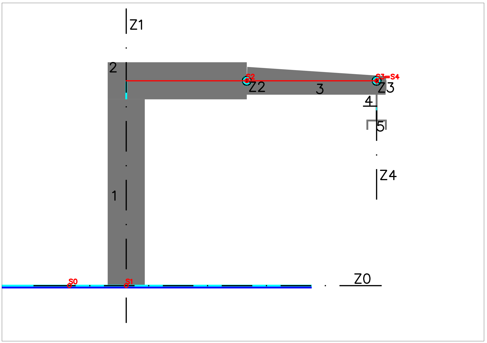
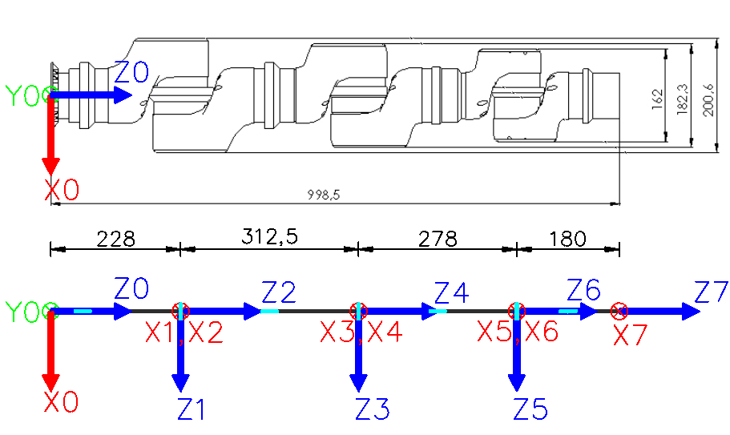

# Denavit–Hartenberg

## Problema 1

Realizar la tabla de parámetros de Denavit–Hartenberg para el robot de la figura.

### Solución

Se utilizará el siguiente esquema para el robot.

Siguiendo los pasos que propone el algoritmo, se obtiene el siguiente resultado.

* -La siguiente figura muestra los pasos 1-6 del algoritmo.  
  -Se muestran en rojo las normales comunes a los ejes.

  

1. El origen de coordenadas S0 \(la base fija\) se sitúa en el punto inicial del carril, donde d1=0.  
   * Los eslabones se numeran del 1 al 5 partiendo de la base \(0\).
2. Las articulaciones se numeran también del 1 al 5, partiendo de la base\(0\).
3. Los ejes son todos rotativos, salvo el 1 que es prismático. Se muestran en la figura mediante línea de eje \(punto-linea\), o mediante un círculo cuando son perpendiculares.
4. Los ejes Zi, empezando por Z0, se sitúan sobre los ejes de la articulación.
5. El origen S0 se sitúa en el eje de la primera articulación.
6. Los orígenes \(Si\) se sitúan en la intersección de Zi y la normal común a Zi+1.
   * La siguiente figura muestra los pasos 7-13 del algoritmo.  
   * Se sustituyen los pares Si, Zi por un vector Zi con origen en Si.

     
7. Los vectores Xi se sitúan sobre las normales comunes y en los orígenes \(Si\) marcados en el paso 6.
8. Los vectores Yi \(omitidos en la figura\) se sitúan de manera dextrógira. Esto es, el producto vectorial de X e Y debe ser igual a Z.
9. Se sitúa Zn en la dirección de Zn-1, y Xn perpendicular.
   * Una vez situados todos los sistemas de coordenadas, se repiten los pasos del 10 al 13 para cada valor de i, desde 1 a n-1.
10. $$\theta_i$$ es el ángulo sobre Zi-1 entre ejes X consecutivos.
11. $$d_i$$ es la distancia sobre Zi-1' \(ya girado\) entre ejes X consecutivos.
12. $$a_i$$ son las distancias sobre Xi-1'' \(girado y movido\) entre ejes Z consecutivos.
13. $$\alpha_i$$ son los ángulos sobre Xi-1''' \(girado, movido y movido\) entre ejes Z consecutivos.
    * En resumen, los últimos cuatro pasos \(10 a 13\) son la transformación de Si-1 en Si mediante giros y traslaciones intrínsecos.
    * La siguiente tabla muestra los valores obtenidos para cada cambio de coordenadas $$^{i-1}A_{i}$$ Si. Distancias en metros, ángulos en grados.

|  | $$\theta_i$$ | $$d_i$$ | $$a_i$$ | $$\alpha_i$$ |
| :--- | :--- | :--- | :--- | :--- |
| 0:i=1 | 0 | $$\color{brown}{d_1}$$ | 0 | -90 |
| 1:i=2 | -90+$$\color{brown}{\theta_2}$$ | c | a | -90 |
| 2:i=3 | 0+$$\color{brown}{\theta_3}$$ | 0 | d | 0 |
| 3:i=4 | 0+$$\color{brown}{\theta_4}$$ | 0 | 0 | -90 |
| 4:i=5 | 0+$$\color{brown}{\theta_5}$$ | e | 0 | 0 |

## Problema 2

Realizar la tabla de parámetros de Denavit–Hartenberg para el robot de la figura. Las articulaciones se muestran en color azul claro. Vistas superior y lateral. 

### Solución

Siguiendo los pasos que propone el algoritmo, se obtiene el siguiente resultado.

*   -La siguiente figura muestra los pasos 1-6 del algoritmo.  

    -Se muestran en rojo las normales comunes a los ejes.

    

1. El origen de coordenadas S0 \(la base fija\) se sitúa coincidiendo con el punto de anclaje del brazo.  
   * Los eslabones se numeran del 1 al 7 partiendo de la base \(0\).
2. Las articulaciones se numeran también del 1 al 7, partiendo de la base\(0\).
3. Los ejes son todos rotativos. Se muestran en la figura mediante línea de eje \(punto-linea\), o mediante un círculo cuando son perpendiculares al plano.
4. Los ejes Zi, empezando por Z0, se sitúan sobre los ejes de la articulación.
5. El origen S0 se sitúa en el eje de la primera articulación.
6. Los orígenes \(Si\) se sitúan en la intersección de Zi y la normal común a Zi+1.

   * La siguiente figura muestra los pasos 7-13 del algoritmo.  
   * Se sustituyen los pares Si, Zi por un vector Zi con origen en Si.

   

7. Los vectores Xi se sitúan sobre las normales comunes y en los orígenes \(Si\) marcados en el paso 6.
8. Los vectores Yi \(omitidos en la figura\) se sitúan de manera dextrógira. Esto es, el producto vectorial de X e Y debe ser igual a Z.
9. Se sitúa Zn en la dirección de Zn-1, y Xn perpendicular.
   * Una vez situados todos los sistemas de coordenadas, se repiten los pasos del 10 al 13 para cada valor de i, desde 1 a n-1.
10. $$\theta_i$$ es el ángulo sobre Zi-1 entre ejes X consecutivos.
11. $$d_i$$ es la distancia sobre Zi-1' \(ya girado\) entre ejes X consecutivos.
12. $$a_i$$ son las distancias sobre Xi-1'' \(girado y movido\) entre ejes Z consecutivos.
13. $$\alpha_i$$ son los ángulos sobre Xi-1''' \(girado, movido y movido\) entre ejes Z consecutivos.
    * En resumen, los últimos cuatro pasos \(10 a 13\) son la transformación de Si-1 en Si mediante giros y traslaciones intrínsecos.
    * La siguiente tabla muestra los valores obtenidos para cada cambio de coordenadas $$^{i-1}A_{i}$$ Si. Distancias en milímetros, ángulos en grados.

|  | $$\theta_i$$ | $$d_i$$ | $$a_i$$ | $$\alpha_i$$ |
| :--- | :--- | :--- | :--- | :--- |
| 0:1 \(i=1\) | 90+$$\color{brown}{q_1}$$ | 228 | 0 | 90 |
| 1:2 \(i=2\) | 0+$$\color{brown}{q_2}$$ | 0 | 0 | -90 |
| 2:3 \(i=3\) | 0+$$\color{brown}{q_3}$$ | 312,5 | 0 | 90 |
| 3:4 \(i=4\) | 0+$$\color{brown}{q_4}$$ | 0 | 0 | -90 |
| 4:5 \(i=5\) | 0+$$\color{brown}{q_5}$$ | 278 | 0 | 90 |
| 5:6 \(i=6\) | 0+$$\color{brown}{q_6}$$ | 0 | 0 | -90 |
| 6:7 \(i=7\) | 0+$$\color{brown}{q_7}$$ | 180 | 0 | 0 |

.

Fin del capítulo

