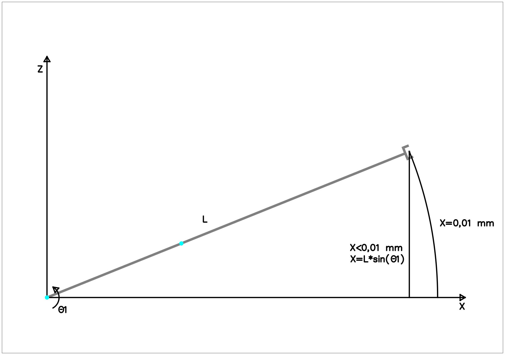

# Morfología

## Problema resuelto 1

El mecanismo de la figura consiste en una transmisión del tipo paralelogramo para mover una articulación de un robot.

La distancia entre el eje del motor-husillo y el soporte de la articulación permanece constante a 250 mm, siendo extensible el brazo que aparece a la izquierda de la articulación para mantener esa distancia constante.

El paralelogramo es movido por un motor AC con resolver, cuyo par máximo es de 0,3 N·m.

Este conjunto motor-husillo ofrece una relación de reducción de 2000 m⁻¹ que permite transformar el movimiento de giro del motor en movimiento de traslación del husillo, con un rendimiento del 80%.

1. Calcular el peso máximo _Q_ que puede soportar el mecanismo en su extremo.
2. Obtener la relación entre el ángulo girado por el motor $$\theta_m$$ y el ángulo girado por la articulación $$\theta _{art}$$.
3. Sabiendo que las ecuaciones del resolver son:

   * $$V1 = V\cdot\sin(\omega t)\cdot\sin(\theta_m)$$
   * $$V2 = V\cdot\sin(\omega t)\cdot\cos(\theta _m)$$

   Siendo \(\theta_m\) el ángulo en que está situado el motor y $$V\cdot\sin(\omega t)$$ la tensión de excitación de la bobina móvil del resolver con $$V$$=24V.

   Si partimos de $$V1$$=0V , $$V2$$=0V , $$\theta_m$$=0 , $$\theta_{art}$$=0 , el motor avanza en sentido positivo dando 150 vueltas dando unos valores finales en el instante de parada de $$V1$$=11.91V , $$V2$$=10V.

   ¿Cual es el valor de $$\theta _{art}$$ en el punto de parada si la posición cero es la que aparece dibujada?

4. ¿Cual sería el rango de la articulación si la máxima longitud del brazo extensible es de 600 mm?

## Solución

### Apartado 1

El brazo extensible tiene en su longitud mínima cuando el brazo está en la posición inicial, así que la posición más desfavorable será la posición inicial. Se deja como ejercicio la demostración.

En el equilibrio, $$T1$$ y $$T2$$ son iguales y de sentido contrario \($$T1 = -T2$$\) , siendo:

* $$T1 = Q \cdot 1,2$$
* $$T2 = F \cdot -0,25$$ N·m

Dividiendo las ecuaciones anteriores, se obtiene:

$$
-1 = {Q \over F} \cdot {1,2 \over -0,25} ;\quad {F} = {4,8 \cdot Q}
$$

Por otro lado, el balance de fuerzas en el husillo se puede hacer de manera fácil mediante un balance de energía.

En la situación ideal, la energía transmitida por el motor al husillo, debe ser la misma que la recibida por el brazo. Esto es, $$E_{rot} = E_{lin}$$ , y en el caso general $$\eta \cdot E_{rot} = E_{lin}$$, siendo:

* $$E_{rot} = M \cdot \theta_m$$, siendo $$\theta$$ el ángulo de giro en radianes.
* $$E_{lin} = F \cdot d$$ , siendo $$d$$ la distancia lineal recorrida por el husillo.

Se presentan dos incógnitas para $$Q$$. Una es el peso que el robot es capaz de _soportar_ en su extremo, y la otra el peso que es capaz de _mover_.

La primera se resuelve mediante el balance de energía para el caso ideal, ya que es una situación estática, en la que $$E_{rot} = E_{lin}$$. Se deja como ejercicio.

La segunda se resuelve dividiendo las dos ecuaciones de energía, teniendo en cuenta que $$\eta ={ E_{lin} \over E_{rot} }={ 0,8 }$$ :

$$
\eta = {E_{lin} \over E_{rot}} ={ {F \cdot d} \over {M \cdot \theta_m} }; \quad F = {\theta \over d} \cdot M \cdot \eta
$$

Según el enunciado, $${\theta \over d}$$ = 2000 m⁻¹. Como no se especifica, se asume que la transmisión está expresada en rad/m.

Para resolver el apartado, sustituimos los valores:

$$
F = {\theta \over d} \cdot M \cdot \eta = 2000 \cdot 0.3 \cdot 0.8 = F = 480 N
$$

Y como $$F = 4.8 \cdot Q$$, $$Q = {F \over 4.8} = {480 \over 4.8} = 100 N \approx 10Kg$$.

### Apartado 2

La transmisión del husillo tiene la relación $${d \over \theta_m} = {1\over2000}$$ m/rad. Ahora se calcula la relación entre $$d$$ y $$\theta_{art}$$.

De acuerdo con la figura, las ecuaciones trigonométricas que relacionan $$d$$ con $$\theta_{art}$$ son

* $$h\cdot\sin{\theta_{art}} = d$$
* $$h\cdot\cos{\theta_{art}} = 0,25$$

Dividiendo estas dos ecuaciones, resulta:

$$
\tan{\theta_{art}} = {d \over 0,25} \quad ; \quad
d=0,25 \tan{\theta_{art}};
$$

Y sustituyendo, resulta:

$$
{ {\theta_m/2000}\over{0,25}} = {\tan{\theta_{art}}} \quad\rightarrow\quad
{\theta_{art}} = {\arctan {\theta_m \over 500} }
$$

### Apartado 3

Dividiendo las ecuaciones del resolver resulta que:

$$
{ { {V1 = V\cdot\sin(\omega t)\cdot\sin(\theta_m)}\over{
V2 }={ V\cdot\sin(\omega t)\cdot\cos(\theta _m)} } }\quad;\quad
{ {V1 \over V2} ={ \tan(\theta _m) } }
$$

Como únicamente se conocen los valores instantáneos de $$V1$$ y $$V2$$ a la parada, no se puede saber a priori si están en fase con la sinusoidal de referencia del resolver.

Se asume que sí lo están, de manera que los valores de $$\sin(\theta_m)$$ y $$\cos(\theta_m)$$ son ambos positivos, lo que implica que el ángulo de giro debe estar en el primer cuadrante.

Sustituyendo, el valor actual de $$\theta _m$$ resulta:

$$
{ {V1 \over V2} ={ \tan(\theta _m) } }= {11,91/10} = {1,191}\quad\rightarrow\quad
{\theta _m} = {\arctan(1,191)}= {0,87 \ rad \approx 50\deg}
$$

Como hay 150 vueltas \($$942,48 \ rad$$\) anteriores, el valor del ángulo final es $$943,35 \ rad$$

Al sustituir éste valor la ecuación anterior resulta un ángulo de :

$$
{\theta_{art}} = {\arctan {943,35 \ rad \over 500}} \quad\rightarrow\quad
{\theta_{art}} = {1,08 \ rad = 62,08\deg}
$$

### Apartado 4

Teniendo en cuenta que $$h\cdot\cos{\theta_{art}} = 0,25$$ \(ver el apartado 2\), y sustituyendo el valor de h por 600 mm \(0,6 m\) resulta:

$$
{\cos(\theta_{art})} = 0,42\quad\rightarrow\quad
\theta_{art} = 1,14 \ rad = 65,38\deg \approx 65\deg
$$

Lo que significa que el rango de la articulación es de \(-65º,+65º\).

## Problema resuelto 2

Dado el robot de 5 GDL de la figura, calcular:

* a\) La articulación 3 \(q3\) se mueve mediante un conjunto Motor AC - Freno - Harmonic Drive, siendo los datos de este último: relación de reducción 120:1, rendimiento del 93%.
  1. Si la carga estática máxima que ha de transportar el robot es de 80 Newton, ¿cual debe ser el par máximo \(N·m\) que debe soportar un freno situado en el eje del motor, aplicando un coeficiente de seguridad del 30%?
  2. Si el motor gira a 900 rpm, ¿a que velocidad está girando la articulación?.
* b\) La articulación 1 \(q1\) se mueve mediante un conjunto Motor AC - Freno - Resolver - Harmonic Drive - Transmisión piñón cremallera. El harmonic drive tiene una relación 175:1 y un rendimiento del 95%. En la transmisión piñón-cremallera, el radio efectivo del piñón es de 0,3 m y su rendimiento del 75%. Las ecuaciones del resolver son las siguientes:

  $$V1 = V\cdot\sin(\omega t)\cdot\sin(\theta_m);$$ $$V2 = V\cdot\sin(\omega t)\cdot\cos(\theta _m)$$

  Siendo $$\theta_m$$ el ángulo en que está situado el motor y $$V\cdot\sin(\omega t)$$ la tensión de excitación de la bobina móvil del resolver con $$V$$=24V.

  1. Si se parte de $$V1$$=0V , $$V2$$=0V , $$\theta_m$$=0 , y el motor avanza en sentido positivo, indicando el resolver 350 pasos por cero, dando unos valores finales en el instante de parada de $$V1$$=17.32V , $$V2$$=10V. ¿Cual es el valor de q1 en el punto de parada?
  2. ¿Cual será la velocidad lineal de la articulación si el motor gira a 110 rpm?

## Solución

### Apartado a1

Si la carga máxima es de 80N, aplicando un coeficiente de seguridad del 30%, la carga de cálculo resulta $$P=1,3*80N=104N$$.

La posición mas desfavorable para q3 es la que se muestra en la figura, y se corresponde con el ángulo q3=0º.

Es claro que el momento en q3 será $$M_3=P*d$$, por lo tanto $$M_3 = 104*d$$.

Para detener la articulación mediante el freno, hay que tener en cuenta la relación de transimsión, pero no el rendimiento de la transimsión, ya que las pérdidas por fricción requieren que haya movimiento. Dividiendo las dos ecuaciones de energía, y teniendo en cuenta que $$\eta ={ E_{3} \over E_{m3} }={ 1 }$$ resulta que:

$$
\eta = {E_{3} \over E_{m3}} ={ {M_3 \cdot \theta_{3}} \over {M_{m3} \cdot \theta_{m3}} } \quad;\quad M_{m3} = { {M_3 \over \eta} \cdot {\theta_{3} \over \theta_{m3} }  }
$$

Para resolver, se sustituyen los valores:

$$
M_{m3} = { {104*d \over 1} \cdot {1 \over 120 }  } = {0,87*d} \quad  [\text N\cdot \text m]
$$

### Apartado a2

Para cualquier periodo de tiempo $$t$$ ocurre que:

$$
q_{3} = \dot q_{3}*t ;\quad
q_{m3} = \dot q_{m3}*t ;
$$

Dividiendo las dos ecuaciones, resulta:

$$
{q_{3} \over q_{m3} } = {\dot q_{3} \over \dot q_{m3} };\quad 
{\dot q_{3}} = {\dot q_{m3} * {q_{3} \over q_{m3} } }=
{\dot q_{m3} * {R_3^{-1} } }
$$

Y sustituyendo, el resultado es:

$$
\dot q_{3} = {900\text{[rpm]}*{1 \over 120} } = {7,5} \text{[rpm]}
$$

### Apartado b1

Dividiendo las ecuaciones del resolver resulta que:

$$
{ {V1 \over V2} ={ \tan(\theta _m) } }
$$

Suponiendo que la sinusoidal está en fase \(como en el problema 1\), y sustituyendo, el valor actual de $$\theta _m$$ resulta:

$$
{\theta _m} = {\arctan(1,732)}= {1,047 \ rad \approx 60\deg}
$$

Como se han contado 350 vueltas \($$2199,11[rad]$$\) , el valor del ángulo final en el eje del motor es $$q_{m1}=2200,16[rad]$$  
La relación de transmisión del harmonic drive es de 175:1, por lo que el ángulo final en el eje de salida del harmonic es de $$q_{h1}={2200,16/175}=12,57[rad]$$

Ahora, la transmisión del piñón-cremallera tiene un radio efectivo del piñón de 0,3\[m\], lo que significa que la relación de transmisión es de $$R_p=0,3[m/rad]$$.

El eje de salida del harmonic drive está aplicado al eje de entrada de la transmisión piñón-cremallera, lo que significa que:

$$
q_1=R_p*q_{h1}
$$

O lo que es lo mismo:

$$
q_1=0,3[m/rad]*12,57[rad]=3,77[m]
$$

### Apartado b2

De manera similar al aparatado anterior \(la demostración se propone como ejercicio\), se puede decir que:

$$
v_1=R_p*R_h*v_{m1}=R*v_{m1}
$$

Y sustituyendo los valores correspondientes, el resultado es:

$$
v_1={0,3\over175}[m/rad]*115,19[rad/s]=0,20[m/s]
$$

## Problema resuelto 3

Para el robot de 2 GDL \($$\theta_1$$ y $$\theta_2$$\) de la figura anterior, diseñar los actuadores y sensores. Estos están compuestos, en cada eje, por un motor DC con encoder en su eje y un engranaje. Calcular:

1. Las reducciones que tienen que tener los reductores, si se conoce que:
   * La velocidad máxima de los motores. $$\dot\theta_{mi}=6000 \text{[rpm]}$$.
   * Al mover cada motor por separado \(estando el otro parado\), la velocidad máxima de la trayectoria en el extremo del robot. $$V_{max}=3000 \text{[mm/seg]}$$.
2. La resolución que tienen que tener los encoders de los ejes si se desea una precisión total de posicionamiento en el extremo de 0,01 \[mm\] \(los reductores son de juego cero\).
3. El máximo peso que puede levantar el robot en su extremo en las condiciones mas desfavorables, si se conoce que:
   * El par motor nominal \(continuo\) de cada motor es de $$T_1=T_2=1$$N·m.
   * El coeficiente de aprovechamiento de los reductores es de $$\eta=80\%$$.
   * Los motores no tienen frenos.

## Solución

### Apartado 1

Para ambas articulaciones, se debe cumplir que:

$$
\dot\theta_{mi}*R_i=\dot\theta_i
$$

Por otra parte, la velocidad lineal en el extremo opuesto a la articulación se calcula mediante la fórmula de movimiento circular del sólido rígido \($$V_p=\dot\theta_i*d$$\), siendo $$d$$ la distancia entre el centro de rotación y el punto $$p$$ dentro del sólido.

Combinando las dos ecuaciones, se obtiene lo siguiente:

$$
V_p=\dot\theta_{mi}*R_i*d
$$

Hay que prestar atención al hecho de que $$d$$ se refiere a la distancia del punto\($$i$$\) al eje de rotación, por tanto, una rotación en q1 genera velocidades lineales en todos los puntos del robot, y en particular $$V_1$$ y $$V_2$$.

El caso más desfavorable para $$\theta_1$$, coincide con el valor máximo de $$d$$, y esto ocurre con $$\theta_2=0 \rightarrow d=1,2+2=3,2\text{[m]}$$, y la velocidad en el extremo del robot, $$V_2$$. Particularizando la ecuación para este caso sería:

$$
{V_2}={\dot\theta_{m1}*R_1*3,2}
$$

Sustituyendo valores, y teniendo en cuenta que $$V_2\le V_{max}$$ y que $$\dot\theta_{m1}=6000 \text{[rpm]}=628,32 \text{[rad/s]}$$ resulta:

$$
{V_2}={628,32\text{[rad/s]}*R_1*3,2\text{[m]}}\le{3 \text{[m/s]}}
$$

$$
{R_1}\le{ {3\text{[m/s]}}\over{628,32\text{[rad/s]}*3,2\text{[m]}} }={ {1}\over{670,21} }
$$

$$
{R_1}={ {1}\over{700} }
$$

Para $$\theta_2$$, la distancia del punto más alejado es $$d=2\text{[m]}$$, y la velocidad en el extremo sigue siendo $$V_2$$. Particularizando la ecuación para este caso sería:

$$
{V_2}={\dot\theta_{m2}*R_2*2}
$$

Sustituyendo valores, y teniendo en cuenta que $$V_2\le V_{max}$$ y que $$\dot\theta_{m2}=6000 \text{[rpm]}=628,32 \text{[rad/s]}$$ resulta:

$$
{V_2}={628,32\text{[rad/s]}*R_2*2\text{[m]}}\le{3 \text{[m/s]}}
$$

$$
{R_2}\le{ {3\text{[m/s]}}\over{628,32\text{[rad/s]}*2\text{[m]}} }={ {1}\over{418,88} }
$$

$$
{R_2}={ {1}\over{500} }
$$

### Apartado 2

El desplazamiento $$X$$ se calcula mediante la fórmula de movimiento circular del sólido rígido \($$X_p=\theta_i*d$$\), siendo $$d$$ la distancia entre el centro de rotación y el punto $$p$$ dentro del sólido. Teniendo en cuenta la reducción y el límite de desplazamiento resulta:

$$
{X_p}={ \theta_{mi}*R_i*d }\le{ X_{min} }
$$

Esto implica que:

$$
{ \theta_{mi} }\le{ {X_{min}}\over{R_i*d} }
$$

La situación más desfavorable es la que provoca un desplazamiento mayor en el extremo \($$X_2$$\). Igual que en el apartado anterior, las distancias mas desfavorables son $$d=3,2\text{[m]}$$ para $$\theta_1$$ y $$d=2\text{[m]}$$ para $$\theta_2$$.

Particularizando para $$\theta_{m1}$$, \($$d=3,2\text{[m]}; {R_1}={1/700}$$\)

$$
{ \theta_{m1} }\le
{ {0,01\text{[mm]}}\over{(1/700)*3,2}\text{[m]} }=
{ {0,01}\over{(1/700)*3,2} }\cdot{ {\text{[m]}}\over{1000\text{[m]}} }=
2,19\times10^{-03}\text{[rad]}
$$

Particularizando para $$\theta_{m2}$$, \($$d=2\text{[m]}; {R_2}={1/500}$$\)

$$
{ \theta_{m2} }\le
{ {0,01\text{[mm]}}\over{(1/500)*2}\text{[m]} }=
{ {0,01}\over{(1/500)*2} }\cdot{ {\text{[m]}}\over{1000\text{[m]}} }=
2,50\times10^{-03}\text{[rad]}
$$

El menor de los dos valores \( $$2,19\times10^{-03}\mathrm{[rad]}$$ \) corresponde a la precisión mínima del encoder.

Como hay 6,28 \[rad\] en cada vuelta completa y el menor de los valores es $$\theta_{m1}= 2,19\times10^{-03}\text{[rad]}$$:

$$
P_e=\frac{6,28\mathrm{[rad/vuelta]}}{2,19\times10^{-03}\mathrm{[rad]}}=2872,31\mathrm{[pulsos/vuelta]}
$$

Se puede comprobar ahora, que para un ángulo de $$\theta_{m1}= 2,19\times10^{-03}\mathrm{[rad]}$$, el desplazamiento es:

$$
{X_p}={ 2,19\times10^{-03}\mathrm{[rad]}*\frac{1}{700}*3,2\mathrm{[m]}}={0,01\mathrm{[mm]}}\le{ X_{min} }
$$

Hay que tener en cuenta, que el desplazamiento calculado corresponde al movimiento circular del manipulador. Como se puede apreciar en la siguiente figura, éste desplazamiento es mayor que el movimiento lineal.

En concreto se corresponde con el siguiente cálculo:

$$
{X_p}={ \sin(\theta_{mi}*R_i)*d }\le{ X_{min} }
$$

Y sustituyendo valores, resulta:

$$
{X_p}={ \sin(2,19\times10^{-03}\mathrm{[rad]}*\frac{1}{700})*3,2\mathrm{[m]}}={0,01\mathrm{[mm]}}\le{ X_{min} }
$$

### Apartado 3

Para mover la articulación mediante el motor, se aplican la reducción y el rendimiento de la transimsión. Dividiendo las dos ecuaciones de energía, y teniendo en cuenta que $$\eta ={ E \over E_m }={ 0,80 }$$ resulta que:

$$
\eta = {E_{1} \over E_{m1}}=
{ {M_1*\theta_{1}} \over { M_{m1}*\theta_{m1}} } \quad;\quad 
M_{1} = { {M_{m1}*\eta}*{\theta_{m1} \over \theta_{1}} }
$$

Para resolver, se sustituyen los valores:

$$
M_{1} = { {1\mathrm{[N \cdot m]}*0,80}*\frac{700}{1} }=
{560,00\mathrm{[N \cdot m]}}
$$

Haciendo el cálculo mecánico, que se deja como ejercicio, se demuestra que la posición mas desfavorable es la que se muestra en la siguiente figura:

Por tanto la máxima carga que puede mover el robot en la posición mas desfavorable se calcula como sigue:

$$
T_1={ P*d } \Rightarrow P=T_1/d
$$

Y sustituyendo:

$$
P=\frac {560,00\mathrm{[N \cdot m]}} {3,2\mathrm{[m]}}=
{175,00\mathrm{[N]} \rightarrow 17,84\mathrm{[Kg]}}
$$

## Problema resuelto 4

El robot de la figura se mueve mediante un conjunto motor-encoder-reductor. El motor es de tipo AC, cuyo par máximo es de 1 \[N·m\], y la velocidad máxima es de 10000 rpm. El reductor es del tipo Harmonic Drive con relación d reducción de 150:1 y rendimiento del 90%.El encoder tiene 100 cuentas por vuelta. La distancia entre el eje del motor y el extremo del robot $$l$$ es de 1 \[m\].  
Se pide:

* a\) Calcular el peso máximo $$Q$$ que puede llevar el robot en su extremo.
* b\) Calcular la resolución lineal del movimiento en el extremo del robot.
* c\) Si el motor gira a su velocidad máxima, ¿a qué velocidad angular \(en \[grados/s\]\) está girando la articulación?

## Solución

### Apartado a

El par solicitado en el caso más desfavorable, es:

$$
T_1=Q*l
$$

Que debe ser igual y de sentido contrario al par ejercido por la articulación.  
Por lo tanto:

$$
{ Q = T_1/l }
$$

Haciendo un balance de energía en la articulación:

$$
\eta = {E_{1} \over E_{m1}} ={ {T_1*\theta_1} \over {T_{1m}*\theta_{1m}} }; \quad 
T_1 = {\theta_{1m} \over \theta_{1}} * T_{1m} * \eta
$$

Y sustituyendo los valores, resulta:

$$
T_1 = { {150 \over 1}* 1\mathrm{[N \cdot m]} * 0,90} = 135 \mathrm{[N \cdot m]}
$$

Teniendo en cuenta lo anterior:

$$
{ Q = T_1/l } = 
{135 \mathrm{[N \cdot m]} / 1 \mathrm{[m]}}=
135 \mathrm{[N]}
$$

### Apartado b

La resolución lineal del robot se corresponde con el desplazamiento **lineal** mínimo en el manipulador en la situación más desfavorable. En este caso, no hay una posición mas desfavorable, así que culaquier posición vale para el cálculo. Se escogerá la cofiguración de $$\theta=0$$.

En la siguiente figura se aprecia por qué el desplazamiento lineal en el manipulador se calcula de la siguiente manera:

$$
{X_p}={ \sin(\theta_{1})*L }
$$

En el caso de la articulación, se sabe que la articulación tiene una reductora de 150:1.  
El encoder tiene 100 cuentas por vuelta. Como no se sabe si estas cuentas son pulsos o cambios en el sistema de medida, se asume que son cambios en el sensor. Esto significa que se puede multiplicar por cuatro mediante cuadratura de la señal, luego $$P_e=4*100=400\mathrm{[pulsos/vuelta]}$$

Entonces, el ángulo mínimo de giro para el motor, será:

$$
\theta_{m1p}={6,28\mathrm{[rad]}/400\mathrm{[pulsos]} }= { 0,0157 \mathrm{[rad/pulso]} }
$$

Como ocurre que $$\theta_{1p}=R_1*\theta_{m1p}$$, se puede afirmar que:

$$
{X_p}={ \sin(R_1*\theta_{m1p})*L }
$$

Y después de sustituir valores, resulta:

$$
{X_p}={ \sin(\frac{1}{150}*0,0157 \mathrm{[rad/pulso]})*1\mathrm{[m]} }=
{ 0,0001\mathrm{[m]}=0,1\mathrm{[mm]} }
$$

Se deja como ejercicio calcular el desplazamiento para movimiento circular y compararlo con el desplazamiento lineal del manipulador.

### Apartado c

Conociendo la relación de transmisión del engranaje, se puede afirmar que:

$$
{ \frac{\dot\theta_{1}}{\dot\theta_{m1}} }={ R_1 }={ \frac{1}{150} };\quad
{ \dot\theta_{1} }={ \frac{\dot\theta_{m1}}{150} }
$$

Por otro lado, se sabe que

$$
{\dot\theta_{m1max}}=10000\mathrm{[rpm]} = 
{ 10000\mathrm{[vuelta/min]}*\frac{360\mathrm{[\deg/vuelta]}}{60\mathrm{[s/min]}} }=
{60000\mathrm{[\deg/s]}}
$$

Entonces, sustituyendo, se tiene que:

$$
{ \dot\theta_{1} }={ \frac{60000\mathrm{[\deg/s]}}{150} }=
{400\mathrm{[\deg/s]}}
$$

Fin del capítulo.

