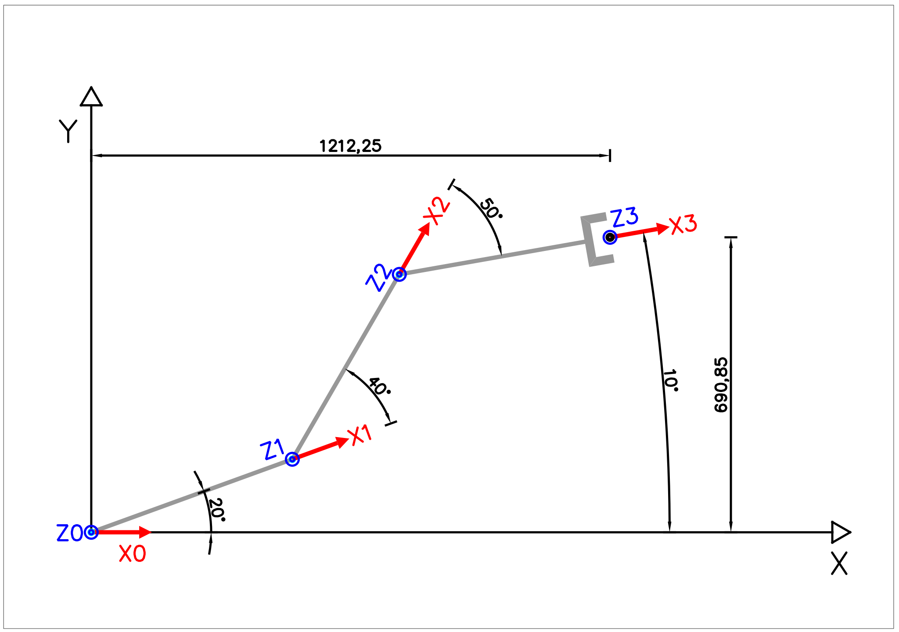

# Cinemática Directa

## Problema 1

Hallar la ecuaciones cinemáticas directas para el manipulador plano de tres grados de libertad mostrado en la figura. La longitud de cada eslabón es de 500 mm, y son todos iguales. Los ángulos para la configuración de la figura son 20º, 40º y -50º.

### Solución

Aplicando el algoritmo DH, obtenemos los siguientes resultados:

* Pasos 1 a 6: Se sitúan los tres eslabones \(E1,E2,E3\) y tres ejes de giro \(Z0,Z1,Z2\). Las normales comunes a los ejes se marcan en rojo.

* Pasos 7 a 9: Se sitúan los sistemas de coordenadas solidarios a cada eslabón \(S1,S2,S3\). El origen de coordenadas de la base se sitúa en S0.

* Pasos 10 a 13: En base a la figura anterior se construye la tabla de parámetros.

|  | $$\theta_i$$ | $$d_i$$ | $$a_i$$ | $$\alpha_i$$ |
| :--- | :--- | :--- | :--- | :--- |
| 0:i=1 | $$\color{brown}{\theta_1}$$ | 0 | $$l_1$$ | 0 |
| 1:i=2 | $$\color{brown}{\theta_2}$$ | 0 | $$l_2$$ | 0 |
| 2:i=3 | $$\color{brown}{\theta_3}$$ | 0 | $$l_3$$ | 0 |

* Paso 14

Las matrices de transformación $$^{i-1}A_{i}$$ son:

$$
{^{0}A_{1}}=
\begin{pmatrix}\cos( {\theta_{1}})  & -\sin( {\theta_{1}})  & 0 & 0\\
 \sin( {\theta_{1}})  & \cos( {\theta_{1}})  & 0 & 0\\
 0 & 0 & 1 & 0\\
 0 & 0 & 0 & 1\end{pmatrix}
*
\begin{pmatrix}1 & 0 & 0 & {l_{1}}\\
 0 & 1 & 0 & 0\\
 0 & 0 & 1 & 0\\
 0 & 0 & 0 & 1\end{pmatrix}
=
\begin{pmatrix}\cos( {\theta_{1}})  & -\sin( {\theta_{1}})  & 0 & {l_{1}}\cdot \cos( {\theta_{1}}) \\
 \sin( {\theta_{1}})  & \cos( {\theta_{1}})  & 0 & {l_{1}}\cdot \sin( {\theta_{1}}) \\
 0 & 0 & 1 & 0\\
 0 & 0 & 0 & 1\end{pmatrix}
$$

$$
{^{1}A_{2}}=
\begin{pmatrix}\cos( {\theta_{2}})  & -\sin( {\theta_{2}})  & 0 & 0\\
 \sin( {\theta_{2}})  & \cos( {\theta_{2}})  & 0 & 0\\
 0 & 0 & 1 & 0\\
 0 & 0 & 0 & 1\end{pmatrix}
*
\begin{pmatrix}1 & 0 & 0 & {l_{2}}\\
 0 & 1 & 0 & 0\\
 0 & 0 & 1 & 0\\
 0 & 0 & 0 & 1\end{pmatrix}
=
\begin{pmatrix}\cos( {\theta_{2}})  & -\sin( {\theta_{2}})  & 0 & {l_{2}}\cdot \cos( {\theta_{2}}) \\
 \sin( {\theta_{2}})  & \cos( {\theta_{2}})  & 0 & {l_{2}}\cdot \sin( {\theta_{2}}) \\
 0 & 0 & 1 & 0\\
 0 & 0 & 0 & 1\end{pmatrix}
$$

$$
{^{2}A_{3}}=
\begin{pmatrix}\cos( {\theta_{3}})  & -\sin( {\theta_{3}})  & 0 & 0\\
 \sin( {\theta_{3}})  & \cos( {\theta_{3}})  & 0 & 0\\
 0 & 0 & 1 & 0\\
 0 & 0 & 0 & 1\end{pmatrix}
*
\begin{pmatrix}1 & 0 & 0 & {l_{3}}\\
 0 & 1 & 0 & 0\\
 0 & 0 & 1 & 0\\
 0 & 0 & 0 & 1\end{pmatrix}
=
\begin{pmatrix}\cos( {\theta_{3}})  & -\sin( {\theta_{3}})  & 0 & {l_{3}}\cdot \cos( {\theta_{3}}) \\
 \sin( {\theta_{3}})  & \cos( {\theta_{3}})  & 0 & {l_{3}}\cdot \sin( {\theta_{3}}) \\
 0 & 0 & 1 & 0\\
 0 & 0 & 0 & 1\end{pmatrix}
$$

* Paso 15

Multiplicando las tres matrices resulta la transformación entre la base y el extremo del robot \(tip\).

$$
T=^{0}A_{1}*^{1}A_{2}*^{2}A_{3}
$$

$$
T=
\begin{pmatrix}
t_{11}  & t_{12}  & 0 & t_{14} \\
t_{21}  & t_{22}  & 0 & t_{24} \\
 0 & 0 & 1 & 0\\
 0 & 0 & 0 & 1\end{pmatrix}
$$

Desarrollando cada término de la matriz se obtiene el siguiente resultado:

* $$t_{11}=\cos( {\theta_{1}}) \cdot ( \cos( {\theta_{2}}) \cdot \cos( {\theta_{3}}) -\sin( {\theta_{2}}) \cdot \sin( {\theta_{3}}) ) -\sin( {\theta_{1}}) \cdot ( \cos( {\theta_{2}}) \cdot \sin( {\theta_{3}}) +\sin( {\theta_{2}}) \cdot \cos( {\theta_{3}}) )$$
* $$t_{12}=\cos( {\theta_{1}}) \cdot ( -\cos( {\theta_{2}}) \cdot \sin( {\theta_{3}}) -\sin( {\theta_{2}}) \cdot \cos( {\theta_{3}}) ) -\sin( {\theta_{1}}) \cdot ( \cos( {\theta_{2}}) \cdot \cos( {\theta_{3}}) -\sin( {\theta_{2}}) \cdot \sin( {\theta_{3}}) )$$
* $$t_{14}=\cos( {\theta_{1}}) \cdot ( -{l_{3}}\cdot \sin( {\theta_{2}}) \cdot \sin( {\theta_{3}}) +{l_{3}}\cdot \cos( {\theta_{2}}) \cdot \cos( {\theta_{3}}) +{l_{2}}\cdot \cos( {\theta_{2}}) )-$$

  $$-\sin( {\theta_{1}}) \cdot ( {l_{3}}\cdot \cos( {\theta_{2}}) \cdot \sin( {\theta_{3}}) +{l_{3}}\cdot \sin( {\theta_{2}}) \cdot \cos( {\theta_{3}}) +{l_{2}}\cdot \sin( {\theta_{2}}) ) +{l_{1}}\cdot \cos( {\theta_{1}})$$

* $$t_{21}=\sin( {\theta_{1}}) \cdot ( \cos( {\theta_{2}}) \cdot \cos( {\theta_{3}}) -\sin( {\theta_{2}}) \cdot \sin( {\theta_{3}}) ) +\cos( {\theta_{1}}) \cdot ( \cos( {\theta_{2}}) \cdot \sin( {\theta_{3}}) +\sin( {\theta_{2}}) \cdot \cos( {\theta_{3}}) )$$
* $$t_{22}=\cos( {\theta_{1}}) \cdot ( \cos( {\theta_{2}}) \cdot \cos( {\theta_{3}}) -\sin( {\theta_{2}}) \cdot \sin( {\theta_{3}}) ) +\sin( {\theta_{1}}) \cdot ( -\cos( {\theta_{2}}) \cdot \sin( {\theta_{3}}) -\sin( {\theta_{2}}) \cdot \cos( {\theta_{3}}) )$$
* $$t_{24}=\sin( {\theta_{1}}) \cdot ( -{l_{3}}\cdot \sin( {\theta_{2}}) \cdot \sin( {\theta_{3}}) +{l_{3}}\cdot \cos( {\theta_{2}}) \cdot \cos( {\theta_{3}}) +{l_{2}}\cdot \cos( {\theta_{2}}) ) +$$

  $$+\cos( {\theta_{1}}) \cdot ( {l_{3}}\cdot \cos( {\theta_{2}}) \cdot \sin( {\theta_{3}}) +{l_{3}}\cdot \sin( {\theta_{2}}) \cdot \cos( {\theta_{3}}) +{l_{2}}\cdot \sin( {\theta_{2}}) ) +{l_{1}}\cdot \sin( {\theta_{1}})$$

La simplificación trigonométrica del resultado anterior mediante las razones trigonométricas del seno y coseno de la suma de dos ángulos \($$\cos(\alpha+\beta)=\cos (\alpha)\cos(\beta)-\sin(\alpha)\sin(\beta)$$ y $$\sin(\alpha+\beta)=\sin (\alpha)\cos(\beta)+\cos(\alpha)\sin(\beta)$$\) es la siguiente:

* $$t_{11}=\cos( {\theta_{1}}) \cdot \cos( {\theta_{3}}+{\theta_{2}}) -\sin( {\theta_{1}}) \cdot \sin( {\theta_{3}}+{\theta_{2}})$$
* $$t_{12}=-\cos( {\theta_{1}}) \cdot \sin( {\theta_{3}}+{\theta_{2}}) -\sin( {\theta_{1}}) \cdot \cos( {\theta_{3}}+{\theta_{2}})$$
* $$t_{14}={l_{3}}\cdot \cos( {\theta_{3}}+{\theta_{2}}+{\theta_{1}}) +{l_{2}}\cdot \cos( {\theta_{2}}+{\theta_{1}}) +{l_{1}}\cdot \cos( {\theta_{1}})$$
* $$t_{21}=\cos( {\theta_{1}}) \cdot \sin( {\theta_{3}}+{\theta_{2}}) +\sin( {\theta_{1}}) \cdot \cos( {\theta_{3}}+{\theta_{2}})$$
* $$t_{22}=\cos( {\theta_{1}}) \cdot \cos( {\theta_{3}}+{\theta_{2}}) -\sin( {\theta_{1}}) \cdot \sin( {\theta_{3}}+{\theta_{2}})$$
* $$t_{24}={l_{3}}\cdot \sin( {\theta_{3}}+{\theta_{2}}+{\theta_{1}}) +{l_{2}}\cdot \sin( {\theta_{2}}+{\theta_{1}}) +{l_{1}}\cdot \sin( {\theta_{1}})$$

Volviendo a simplificar de la misma forma los demás términos resulta:

* $$t_{11}=\cos( {\theta_{3}}+{\theta_{2}}+{\theta_{1}})$$
* $$t_{12}=-\sin( {\theta_{3}}+{\theta_{2}}+{\theta_{1}})$$
* $$t_{14}={l_{3}}\cdot \cos( {\theta_{3}}+{\theta_{2}}+{\theta_{1}}) +{l_{2}}\cdot \cos( {\theta_{2}}+{\theta_{1}}) +{l_{1}}\cdot \cos( {\theta_{1}})$$
* $$t_{21}=\sin( {\theta_{3}}+{\theta_{2}}+{\theta_{1}})$$
* $$t_{22}=\cos( {\theta_{3}}+{\theta_{2}}+{\theta_{1}})$$
* $$t_{24}={l_{3}}\cdot \sin( {\theta_{3}}+{\theta_{2}}+{\theta_{1}}) +{l_{2}}\cdot \sin( {\theta_{2}}+{\theta_{1}}) +{l_{1}}\cdot \sin( {\theta_{1}})$$

Si se reconstruye la matriz con los términos simplificados resulta:

$$T= \begin{pmatrix}\cos\( {\theta_{3}}+{\theta_{2}}+{\theta_{1}}\) & -\sin\( {\theta_{3}}+{\theta_{2}}+{\theta_{1}}\) & 0 & {l_{3}}\cdot \cos\( {\theta_{3}}+{\theta_{2}}+{\theta_{1}}\) +{l_{2}}\cdot \cos\( {\theta_{2}}+{\theta_{1}}\) +{l_{1}}\cdot \cos\( {\theta_{1}}\) \ \sin\( {\theta_{3}}+{\theta_{2}}+{\theta_{1}}\) & \cos\( {\theta_{3}}+{\theta_{2}}+{\theta_{1}}\) & 0 & {l_{3}}\cdot \sin\( {\theta_{3}}+{\theta_{2}}+{\theta_{1}}\) +{l_{2}}\cdot \sin\( {\theta_{2}}+{\theta_{1}}\) +{l_{1}}\cdot \sin\( {\theta_{1}}\) \ 0 & 0 & 1 & 0\ 0 & 0 & 0 & 1\end{pmatrix}

$$
El resultado anterior describe la posición y orientación del manipulador (S3), respecto de la base (S0). En concreto, la pose del manipulador se corresponde con:
* $$x=t_{14}={l_{3}}\cdot \cos( {\theta_{3}}+{\theta_{2}}+{\theta_{1}}) +{l_{2}}\cdot \cos( {\theta_{2}}+{\theta_{1}}) +{l_{1}}\cdot \cos( {\theta_{1}})
$$

* $$y=t_{24}={l_{3}}\cdot \sin( {\theta_{3}}+{\theta_{2}}+{\theta_{1}}) +{l_{2}}\cdot \sin( {\theta_{2}}+{\theta_{1}}) +{l_{1}}\cdot \sin( {\theta_{1}})$$
* $$Rot=M\_{3x3}=

  \begin{pmatrix}\cos\( {\theta_{3}}+{\theta_{2}}+{\theta_{1}}\)  & -\sin\( {\theta_{3}}+{\theta_{2}}+{\theta_{1}}\)  & 0 \

  \sin\( {\theta_{3}}+{\theta_{2}}+{\theta_{1}}\)  & \cos\( {\theta_{3}}+{\theta_{2}}+{\theta_{1}}\)  & 0  \

  0 & 0 & 1\end{pmatrix}

  $$

Como el robot es plano, la rotación sólo puede ser un giro sobre el eje z. Al comparar el resultado con una matriz de rotación de un ángulo $$\alpha$$ sobre el eje z, se concluye que $$\alpha={\theta_{3}}+{\theta_{2}}+{\theta_{1}}$$.

Si se sustituyen los valores de los ángulos propuestos por el enunciado en la matriz $$T$$, el resultado numérico es el siguiente:

$$
T=
\begin{pmatrix}0.98 & -0.17 & 0 & 1.2\\
 0.17 & 0.98 & 0 & 0.69\\
 0 & 0 & 1 & 0\\
 0 & 0 & 0 & 1\end{pmatrix}
$$

Como se puede apreciar en la siguiente figura, el resultado se corresponde con las medidas reales.

## Problema 2

Hallar las ecuaciones cinemáticas directas para el robot de la figura.

