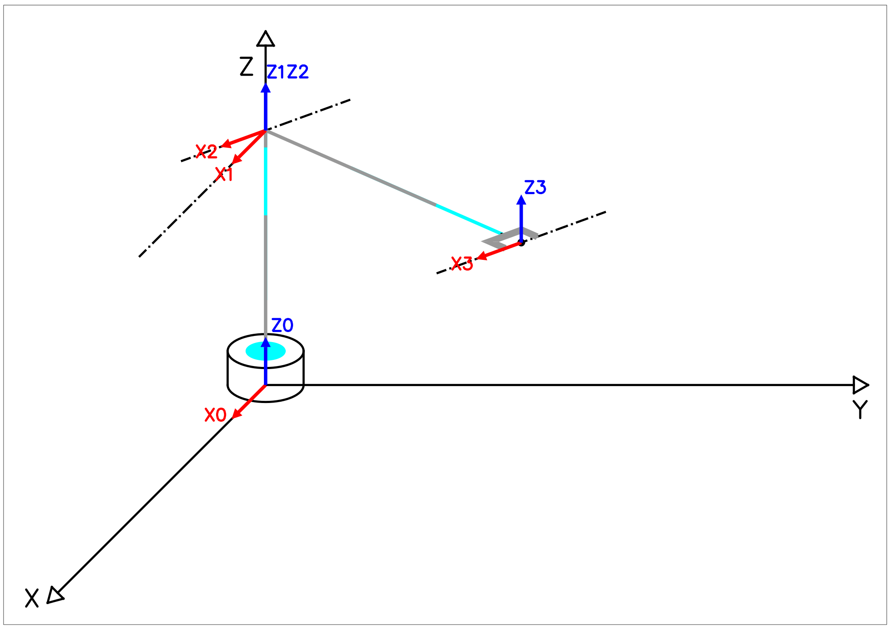
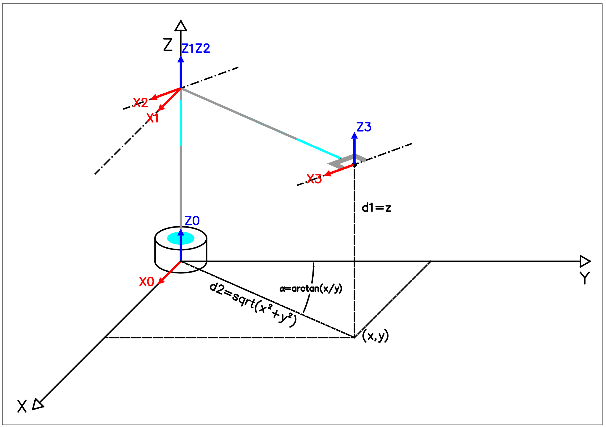

# Cinemática D. Inversa

## Ejercicio 1

El robot de la figura tiene 3 GDL \($$\alpha,d_1,d_2$$\). El rango de variación de cada una de sus articulaciones es: $$d_1$$ de 50 a 100 cm, $$d_2$$ de 100 a 200 cm, $$\alpha$$ de 0deg a 360 deg. Se pide: 1. Obtener la transformada cinemática directa e inversa del robot. 2. Obtener la relación entre velocidades articulares \($$\alpha,d_2$$\) y el extremo del robot en el plano de movimiento, usando las matrices Jacobiana y Jacobiana inversa. 3. Calcular las velocidades articulares para $$\dot x= 1 \mathrm{[m/s]}$$, $$\dot y= 1 \mathrm{[m/s]}$$ para los puntos $$P_1=(106,106,75)$$ y $$P_2=(56,56,75)$$. 4. Indicar razonando los puntos singulares que tiene el robot.

### Solución

### Apartado 1

Para el cálculo de la cinemática, se requiere la transformación entre la base y el manipulador.

Mediante el método de Denavit-Hartenberg, se obtendrían los siguientes esquemas:

Esquema de eslabones y articulaciones. 

Esquema de sistemas coordenados. 

Aunque en este caso, se aprecia una solución más directa mediante una distribución diferente de los ejes de coordenadas como la que se muestra a continuación.

Así que se opta por la solución más sencilla. Las matrices de transformación en este caso serán:

$$^{0}A_{1}= \begin{pmatrix} 1 & 0 & 0 & 0\ 0 & 1 & 0 & 0\ 0 & 0 & 1 & {d_{1}}\ 0 & 0 & 0 & 1\end{pmatrix}

$$
$$^{1}A_{2}=
\begin{pmatrix}\cos{( -\alpha) } & -\sin{( -\alpha) } & 0 & 0\\
\sin{( -\alpha) } & \cos{( -\alpha) } & 0 & 0\\
0 & 0 & 1 & 0\\
0 & 0 & 0 & 1\end{pmatrix}
=
\begin{pmatrix}
\cos{( \alpha) } & \sin{( \alpha) } & 0 & 0\\
-\sin{( \alpha) } & \cos{( \alpha) } & 0 & 0\\
0 & 0 & 1 & 0\\
0 & 0 & 0 & 1\end{pmatrix}
$$

$$^{2}A_{3}= \begin{pmatrix}1 & 0 & 0 & 0\ 0 & 1 & 0 & {d_{2}}\ 0 & 0 & 1 & 0\ 0 & 0 & 0 & 1\end{pmatrix}

$$
Y finalmente:
$$

T= \begin{pmatrix} \cos{\( \alpha\) } & \sin{\( \alpha\) } & 0 & d_{2}\,\sin{\( \alpha\) }\ -\sin{\( \alpha\) } & \cos{\( \alpha\) } & 0 & {d_{2}}\,\cos{\( \alpha\) }\ 0 & 0 & 1 & {d\_{1}}\ 0 & 0 & 0 & 1\end{pmatrix}

$$
Las ecuaciones cinemáticas directas serán entonces:

* $$x={d_{2}}\,\sin{( \alpha) }
$$

* $$y={d_{2}}\,\cos{( \alpha) }$$
* $$z={d_{1}}$$

Para las ecuaciones cinemáticas inversas, es evidente que $${d_{1}}=z$$. A continuación se calcularán $$d_2$$ y $$\alpha$$ en función de $$x,y$$.

Dividiendo las ecuaciones se obtiene:

$$
{x/y}=\frac{ d_{2}\,\sin{( \alpha) } }{ d_{2}\,\cos{( \alpha) }}=
\frac{\sin{( \alpha) }}{\cos{( \alpha) }}=
\tan{( \alpha) }
$$

Entonces, $$\alpha= \arctan{(x/y)}$$.

La suma de las ecuaciones al cuadrado permite obtener $$d_2$$ de la siguiente manera:

$$
x^2+y^2={d_{2}}^2\,\sin^2{( \alpha) } + {d_{2}}^2\,\cos^2{( \alpha) }=
d_2^2
$$

Lo que implica que $$d_2=\sqrt{x^2+y^2}$$

En resumen:

* $$d_1=z$$
* $$d_2=\sqrt{x^2+y^2}$$
* $$\alpha= \arctan{(x/y)}$$

En la siguiente figura se aprecia el anterior resultado en forma geométrica.

### Apartado 2

Las derivadas parciales de la cinemática directa son:

* $$\frac{\partial x}{\partial d_2}=\sin{( \alpha) }$$
* $$\frac{\partial x}{\partial \alpha}=d_2\cos{( \alpha) }$$
* $$\frac{\partial y}{\partial d_2}=\cos{( \alpha) }$$
* $$\frac{\partial y}{\partial \alpha}=-d_2\sin{( \alpha) }$$
* $$\frac{\partial z}{\partial d_1}=1$$

Así que la matriz Jacobiana es:

$$
J=
\begin{pmatrix}
0 & \sin{( \alpha) } & d_2\cos{( \alpha) } \\
0 & \cos{( \alpha) } & -d_2\sin{( \alpha) } \\
1 & 0 & 0 \\
\end{pmatrix}
$$

Para el cálculo de la inversa, se hace primero el cálculo del determinante. Se hará el cálculo por adjuntos, ya que los adjuntos también sirven para la inversa.

$$\|J\|=+1_\(d\_2\sin^2{\(\alpha\)}+d\_2\cos^2{\(\alpha\)}\)= +1_\(-d\_2\)

$$
$$
|J|=-d_2
$$

El determinante se utilizará también para el último apartado. Mientras tanto, los adjuntos de J son:

* $$A_{11}=(+)0=0$$
* $$A_{12}=(-)d_2\sin{(\alpha)}=-d_2\sin{(\alpha)}$$
* $$A_{13}=(+)-\cos{( \alpha) }=-\cos{( \alpha) }$$
* $$A_{21}=(-)0=0$$
* $$A_{22}=(+)-d_2\cos{(\alpha)}=-d_2\cos{(\alpha)}$$
* $$A_{23}=(-)-\sin{(\alpha)}=\sin{(\alpha)}$$
* $$A_{31}=(+)-d_2=-d_2$$
* $$A_{32}=(-)0=0$$
* $$A_{33}=(+)0=0$$

Y la matriz $$(J^*)^t$$ será:

$$
(J^*)^t=
\begin{pmatrix}
0 & 0 & -d_2\\ 
-d_2\sin{(\alpha)} & -d_2\cos{(\alpha)} & 0 \\ 
-\cos{( \alpha) } & \sin{(\alpha)} & 0 \\
\end{pmatrix}
$$

Y la matriz inversa es:

$$
J^{-1}=
\begin{pmatrix}
0 & 0 & 1\\ 
\sin{(\alpha)} & \cos{(\alpha)} & 0 \\ 
\cos{( \alpha) }/{d_2} & -\sin{(\alpha)}/{d_2} & 0 \\
\end{pmatrix}
$$

Se observa que $$J^{-1}$$ debe coincidir con la Jacobiana de la cinemática inversa. Su demostración se deja como ejercicio.

Ahora, como se pide en el apartado, se calcula la velocidad en el manipulador en función de las velocidades articulares.

Siendo: $$\dot X = \begin{pmatrix} \dot x\\ \dot y\\ \dot z\\ \end{pmatrix}$$; $$\dot Q = \begin{pmatrix} \dot d\_1\ \dot d\_2\ \dot \alpha\ \end{pmatrix}

$$
Como $$\dot X = J* \dot Q$$ se tiene que:

$$J* \dot Q= 
\begin{pmatrix}
0 & \sin{( \alpha) } & d_2\cos{( \alpha) } \\
0 & \cos{( \alpha) } & -d_2\sin{( \alpha) } \\
1 & 0 & 0 \\
\end{pmatrix}
*
\begin{pmatrix}
\dot d_1\\
\dot d_2\\
\dot \alpha\\
\end{pmatrix}
=
\begin{pmatrix}\sin{( \alpha) }\,{\dot d_2}+{d_{2}}\,\cos{( \alpha) }\,\dot \alpha\\
\cos{( \alpha) }\,{\dot d_2}-{d_{2}}\,\sin{( \alpha) }\,\dot \alpha\\
{\dot d_1}\end{pmatrix}
$$

Entonces las velocidades del manipulador en función de las articulaciones \($$\dot X$$\) serán:

$$
\dot X =
\begin{pmatrix}
\dot x\\
\dot y\\
\dot z\\
\end{pmatrix}
=
\begin{pmatrix}\sin{( \alpha) }\,{\dot d_2}+d_{2}\,\cos{( \alpha) }\,\dot \alpha\\
\cos{( \alpha) }\,{\dot d_2}-d_{2}\,\sin{( \alpha) }\,\dot \alpha\\
{\dot d_1}\end{pmatrix}
$$

También se puede utilizar la ecuación $$\dot Q = J^{-1}* \dot X$$ :

$$J^{-1} _\dot X= \begin{pmatrix} 0 & 0 & 1\ \sin{\(\alpha\)} & \cos{\(\alpha\)} & 0 \ \cos{\( \alpha\) }/d\_2 & -\sin{\(\alpha\)}/d\_2 & 0 \ \end{pmatrix}_  \begin{pmatrix} \dot x\ \dot y\ \dot z\ \end{pmatrix} = \begin{pmatrix}\dot z\ \cos{\( \alpha\) }\,\dot y+\sin{\( \alpha\) }\,\dot x\ {\cos{\( \alpha\) }\,\dot x}/d_{2}-{\sin{\( \alpha\) }\,\dot y}/d_{2}\end{pmatrix}

$$
Resultando que:
$$

\dot Q = \begin{pmatrix} \dot d_1\ \dot d\_2\ \dot \alpha\ \end{pmatrix} = \begin{pmatrix}\dot z\ \cos{\( \alpha\) }\,\dot y+\sin{\( \alpha\) }\,\dot x\ \frac{\cos{\( \alpha\) }\,\dot x}{d_{2}}-\frac{\sin{\( \alpha\) }\,\dot y}{d\_{2}}\end{pmatrix}

$$
Hay que poner especial atención a las unidades, sobre todo las de $$\dot \alpha$$. Se observa que en ambos casos, el resultado depende de la configuración del robot.

###Apartado 3

Para calcular las velocidades articulares ($$\dot Q$$)en función de las velocidades en el manipulador ($$\dot x, \dot y$$), se utiliza el segundo de los resultados anteriores, recordando que:

* $$\dot d_1=\dot z
$$

* $$\dot d_2=\cos{( \alpha) }\,\dot y+\sin{( \alpha) }\,\dot x$$
* $$\dot \alpha=\frac{\cos{( \alpha) }\,\dot x}{d_{2}}-\frac{\sin{( \alpha) }\,\dot y}{d_{2}}$$

Los puntos en los que se piden las velocidades, son:

* $$P_1=(106,106,75)$$
* $$P_2=(56,56,75)$$

Por la cinemática inversa se conocen las configuraciones $$Q_1$$ y $$Q_2$$:

* $$Q_1= (75,150,\pi/4)$$
* $$Q_2= (75,79.2,\pi/4)$$

Sustituyendo los valores de $$\dot x= 1 \mathrm{[m/s]}$$ y $$\dot y= 1 \mathrm{[m/s]}$$ se obtienen las ecuaciones siguientes:

* $$\dot d_2=\cos{( \alpha) }*100 \mathrm{[cm/s]}+\sin{( \alpha) }*100 \mathrm{[cm/s]}$$
* $$\dot \alpha=\frac{\cos{( \alpha) }*100 \mathrm{[cm/s]}}{d_{2}}-\frac{\sin{( \alpha) }*100 \mathrm{[cm/s]}}{d_{2}}$$

Teniendo en cuenta que las dos configuraciones tienen el mismo ángulo, y que $$\cos{(\pi/4)}=\sin{(\pi/4)}=0.7071$$ resulta:

* $$\dot d_2=70.71 \mathrm{[cm/s]}+70.71 \mathrm{[cm/s]}=141.42\mathrm{[cm/s]}$$
* $$\dot \alpha=\frac{70.71\mathrm{[cm/s]}}{d_{2}}-\frac{70.71 \mathrm{[cm/s]}}{d_{2}}=0\mathrm{[rad/s]}$$

Por tanto, se resuelve que en ambos casos será:

* $$\dot d_2=141.42\mathrm{[cm/s]}$$
* $$\dot \alpha=0\mathrm{[rad/s]}$$

### Apartado 4

Ya se ha calculado previamente $$|J|=-d_2$$, por lo que los puntos singulares ocurren con $$d_2=0$$.  
Dados los límites del robot, nunca se llegará a la configuración indicada. Si fuera el caso, se trataría de una cinemática inversa con infinitas soluciones.

.

.

.

. Fin del capítulo.

