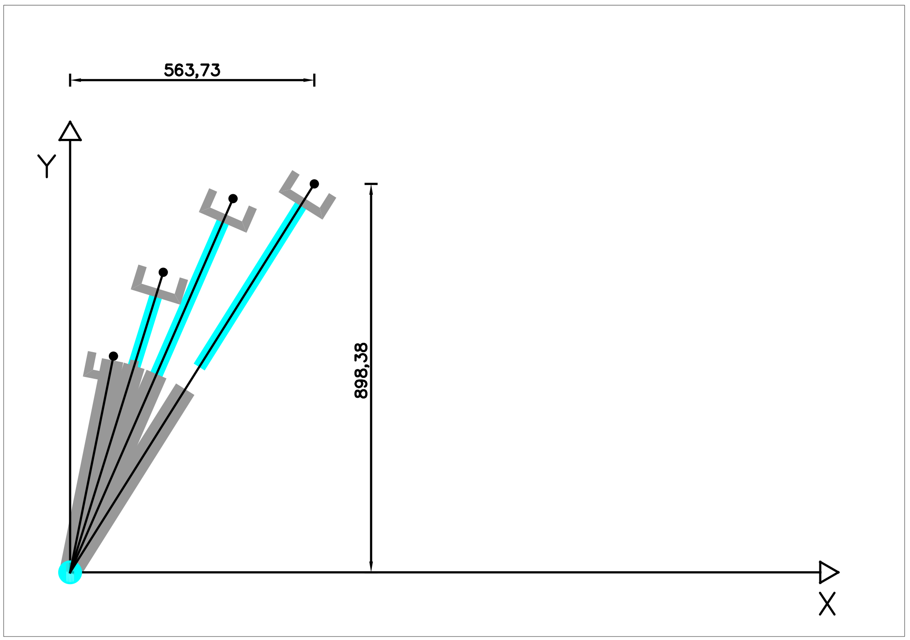
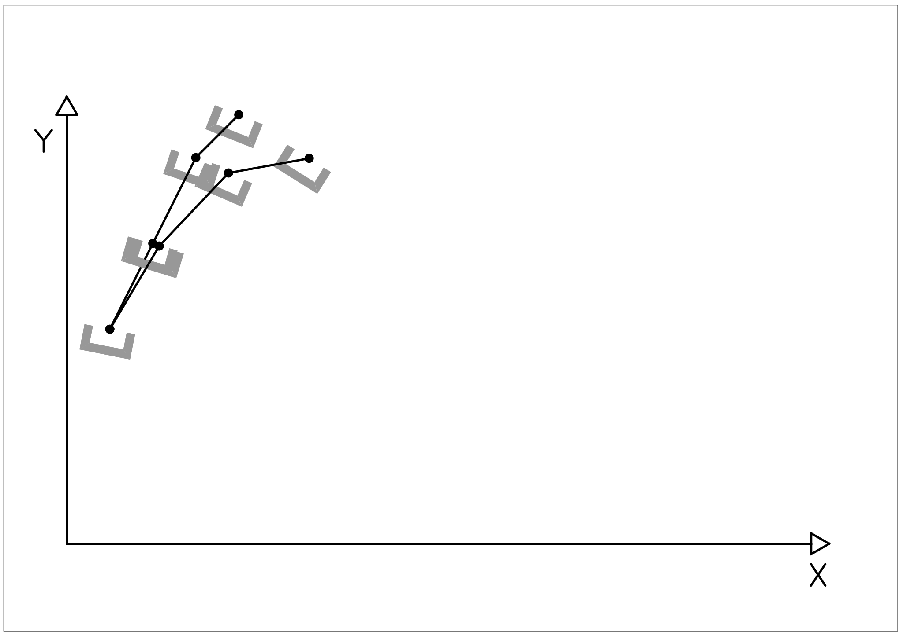
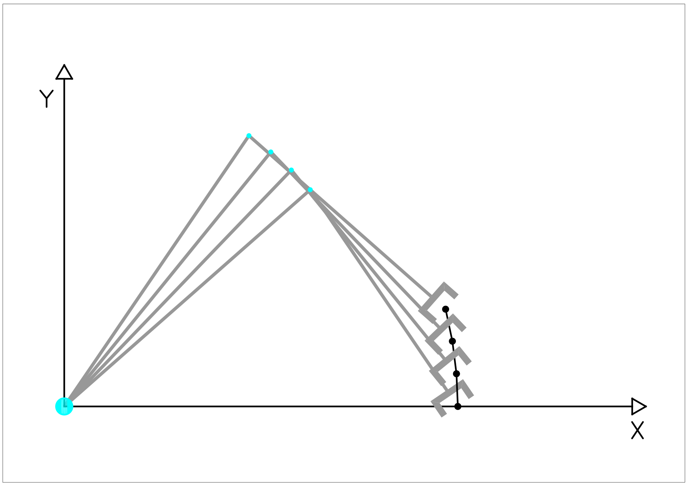
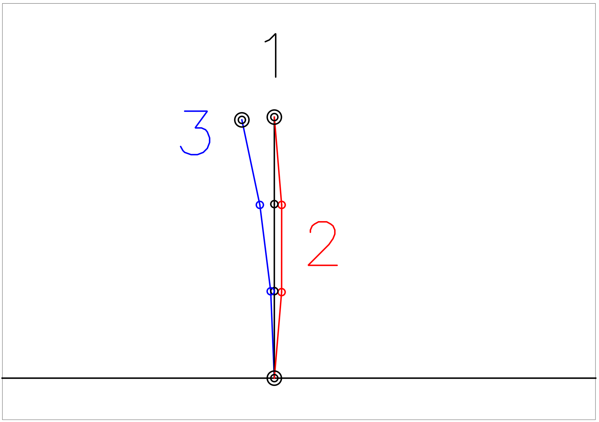

# Trayectorias

## Ejercicio 1

El robot de la figura tiene 2 GDL $$(d_1,\theta_1)$$. El rango de variación de cada una de sus articulaciones es:

* $$d_1$$: de 50 a 100 mm.
* $$\theta_1$$: de 0 a 360 deg.

El robot realiza una trayectoria en línea recta recorriendo los puntos $$p_1(10,50); p_2(20,70); p_3(30,90);P_4(40,100)$$.  
Se pide:

1. Obtener la transformada cinemática directa e inversa del robot.
2. Obtener las matrices Jacobiana y Jacobiana inversa.
3. Calcular la trayectoria del extremo del robot para los puntos $$p_i$$ utilizando la transformada cinemática inversa.
4. Calcular la trayectoria del extremo del robot para los puntos $$p_i$$ utilizando la matriz Jacobiana en el punto $$p_1$$.
5. Comparar los resultados obtenidos.
6. Indicar de manera razonada los puntos singulares del robot.

### Solución

El dibujo esquemático del robot es el siguiente:

Como se aprecia en la figura, la transformación desde S0 a S1 describe la posición y orientación del manipulador respecto de la base.

### 1. Obtener la transformada cinemática directa e inversa del robot.

Las operaciones intrínsecas para transformar S0 en S1 son, por este orden: 1. Giro de $$\theta_1$$ sobre $$z_0$$. 2. Desplazamiento de $$d_1$$ sobre $$x_0$$.

Las matrices homogéneas que describen la transformación son:

$$H_1= \begin{pmatrix}\cos\( {\theta_{1}}\) & -\sin\( {\theta_{1}}\) & 0 & 0\ \sin\( {\theta_{1}}\) & \cos\( {\theta_{1}}\) & 0 & 0\ 0 & 0 & 1 & 0\ 0 & 0 & 0 & 1\end{pmatrix} ; H\_2= \begin{pmatrix}1 & 0 & 0 & {d_{1}}\ 0 & 1 & 0 & 0\ 0 & 0 & 1 & 0\ 0 & 0 & 0 & 1\end{pmatrix}

$$
Por tanto:
$$

T= \begin{pmatrix}\cos\( {\theta_{1}}\) & -\sin\( {\theta_{1}}\) & 0 & {d_{1}}\cdot \cos\( {\theta_{1}}\) \ \sin\( {\theta_{1}}\) & \cos\( {\theta_{1}}\) & 0 & {d_{1}}\cdot \sin\( {\theta_{1}}\) \ 0 & 0 & 1 & 0\ 0 & 0 & 0 & 1\end{pmatrix}

$$
El robot es plano y tiene 2 grados de libertad, por lo tanto tiene 2 variables independientes. Como los puntos de paso se definen en coordenadas, se eligen las coordenadas del manipulador (x,y) como variables independientes. El ángulo del manipulador será dependiente de la posición.

La cinemática directa, es entonces:
* $$x={d_{1}}\cdot \cos( {\theta_{1}})
$$

* $$y={d_{1}}\cdot \sin( {\theta_{1}})$$

La cinemática inversa, resolviendo mediante la división $$y/x$$ y la suma de cuadrados $$x^2+y^2$$ resulta:

* $$\theta_{1}=\arctan(y/x)$$
* $$d_1=\sqrt{x^2+y^2}$$

En la siguiente figura se aprecia el mismo resultado obtenido mediante métodos geométricos.

### 2. Obtener las matrices Jacobiana y Jacobiana inversa.

Primero se calculan las derivadas parciales para la matriz Jacobiana.

* $$\frac{\partial x}{\partial \theta_1} = -{d_{1}}\cdot \sin( {\theta_{1}})$$
* $$\frac{\partial x}{\partial d_1} = \cos( {\theta_{1}})$$
* $$\frac{\partial y}{\partial \theta_1} = {d_{1}}\cdot \cos( {\theta_{1}})$$
* $$\frac{\partial y}{\partial d_1} = \sin( {\theta_{1}})$$

Una vez calculados los valores, cuando se construye la matriz por términos, el resultado es el siguiente:

$$
J=
\begin{pmatrix}
\frac{\partial x}{\partial \theta_1} &
\frac{\partial x}{\partial d_1} \\
\frac{\partial y}{\partial \theta_1} &
\frac{\partial y}{\partial d_1}
\end{pmatrix}
=
\begin{pmatrix}-{d_{1}}\cdot \sin( {\theta_{1}})  & \cos( {\theta_{1}}) \\
 {d_{1}}\cdot \cos( {\theta_{1}})  & \sin( {\theta_{1}}) \end{pmatrix}
$$

Ahora, para invertir la matriz se calcula el determinante.

$$\|J\|= -d_{1}\cdot \sin\( \theta_{1}\) ^{2} -d_{1}\cdot \cos\( \theta_{1}\) ^{2} = {-d\_1}

$$
Se observa que el punto singular ocurre cuando $$d_1=0$$, y es del tipo infinitas soluciones.  
Como el rango de la articulación $$d_1$$ es de 50 mm a 100 mm, este punto no será un problema, ya que $$d_1=0$$ no es posible.

A continuación se calcula la matriz inversa. Para el cálculo se necesitan la matriz adjunta y el determinante, ya que $$J^{-1}=\frac{(J^{*})^t}{|J|}$$.

Los términos de la matriz adjunta son:
* $$A_{11}=\sin( {\theta_{1}})
$$

* $$A_{12}=-{d_{1}}\cdot \cos( {\theta_{1}})$$
* $$A_{21}=-\cos( {\theta_{1}})$$
* $$A_{22}=-{d_{1}}\cdot \sin( {\theta_{1}})$$

Por lo tanto:

$$\(J^{\*}\)^t= \begin{pmatrix} A_{11} & A_{21} \ A_{12} & A_{22} \end{pmatrix} = \begin{pmatrix} \sin\( {\theta_{1}}\) & -\cos\( {\theta_{1}}\)\ -{d_{1}}\cdot \cos\( {\theta_{1}}\) & -{d_{1}}\cdot \sin\( {\theta_{1}}\) \end{pmatrix}

$$
Y la inversa:
$$

J^{-1}= \begin{pmatrix} -\sin\( {\theta_{1}}\)/d\_1 & \cos\( {\theta_{1}}\)/d_1\ \cos\( {\theta_{1}}\) & \sin\( {\theta\_{1}}\) \end{pmatrix}

$$
###Apartado 3
Calcular la trayectoria del extremo del robot para los puntos $$p_i$$ utilizando la transformada cinemática inversa.

Los puntos de paso de la trayectoria se obtienen sustituyendo las coordenadas de los puntos en las funciones de la cinemática inversa. La siguiente tabla muestra el resultado.

* $$\theta_{1}=\arctan(y/x)
$$

* $$d_1=\sqrt{x^2+y^2}$$

| punto | $$x$$ | $$y$$ | $$\theta_{1}$$ | $$d_1$$ |
| :--- | :--- | :--- | :--- | :--- |
| $$p_1$$ | 10 | 50 | 1.37 | 50.99 |
| $$p_2$$ | 20 | 70 | 1.29 | 72.80 |
| $$p_3$$ | 30 | 90 | 1.25 | 94.87 |
| $$p_4$$ | 40 | 100 | 1.19 | 107.70 |

La siguiente figura muestra la trayectoria de forma gráfica.

Se puede apreciar tanto en la tabla como en la figura, que el punto p4 está fuera de alcance del robot, ya que la articulación $$d_1$$ tiene un límite de 100cm.

### Apartado 4

Calcular la trayectoria del extremo del robot para los puntos $$p_i$$ utilizando la matriz Jacobiana en el punto $$p_1$$.

Para utilizar la Jacobiana como interpolador se necesita un punto completo \(espacio y configuración\), que se utiliza como centro de la interpolación. Como dice el enunciado se utilizará el punto 1.

* $$p_1=(10,50)$$.
* $$ik(p1)=q_1=(1.37,50.99)$$.

Los puntos conocidos están en el espacio de trabajo, por lo tanto, los puntos interpolados estarán en el espacio de configuraciones. En este caso, se necesita la inversa de la Jacobiana. La función de interpolación será:

$$
ik(p)=ik(p_1)+J^{-1}(p_1)*(p-p_1)
$$

Por tanto, la función que se interpola es la función de cinemática inversa \( $$ik(x,y) = (\theta_1,d_1)$$ \) del robot.

Por claridad, se nombra el término $$J^{-1}(p_1)*(p-p_1)$$ como $$\delta q$$. Calculando este término de manera simbólica se obtiene una ecuación que permite interpolar el valor de la cinemática inversa para cualquier punto $$p_i$$ cercano a $$p_1$$.

Según el resultado del apartado 2, la Jacobiana inversa es:

$$J^{-1}= \begin{pmatrix} -\sin\( {\theta_{1}}\)/d\_1 & \cos\( {\theta_{1}}\)/d_1\ \cos\( {\theta_{1}}\) & \sin\( {\theta\_{1}}\) \end{pmatrix}

$$
Sustituyendo valores para $$p_1$$ resulta:

$$J^{-1}=
\begin{pmatrix}
-0.019 & 0.004 \\
0.196 & 0.981
\end{pmatrix}
$$

Por otro lado $$(p-p_1) = (x-10,y-50)$$. Si se multiplican las partes:

$$J^{-1}\(p\_1\)_\(p-p\_1\)= \begin{pmatrix} -0.019 & 0.004 \ 0.196 & 0.981 \end{pmatrix}_  \begin{pmatrix} x-10\ y-50 \end{pmatrix} =

\begin{pmatrix} 0.004\cdot y - 0.019\cdot x - 0.003\ 0.981\cdot y + 0.199\cdot x - 50.989 \end{pmatrix}

$$
Luego
$$

\delta{q}= \begin{pmatrix} 0.004\cdot y - 0.019\cdot x - 0.003\ 0.981\cdot y + 0.199\cdot x - 50.989 \end{pmatrix}

$$
Y también se puede escribir que:

* $$\delta{\theta_1}=0.004\cdot y - 0.019\cdot x - 0.003
$$

* $$\delta{d_1}=0.981\cdot y + 0.199\cdot x - 50.989$$

La siguiente tabla muestra el resultado de sustituir los valores $$(x,y)$$ en todos los puntos de la trayectoria:

| p | $$x$$ | $$y$$ | $$\delta{\theta_1}$$ | $$\delta{d_1}$$ | $$ik(p1)+\delta{\theta_1}$$ | $$ik(p1)+\delta{d_1}$$ |
| :--- | :--- | :--- | :--- | :--- | :--- | :--- |
| p1 | 10 | 50 | 0 | 0 | 1.37 | 50.99 |
| p2 | 20 | 70 | -0.10 | 21.66 | 1.27 | 72.65 |
| p3 | 30 | 90 | -0.21 | 43.27 | 1.16 | 94.26 |
| p4 | 40 | 100 | -0.36 | 55.07 | 1.01 | 106.06 |

La siguiente figura muestra la trayectoria de forma gráfica.

Se puede apreciar tanto en la tabla como en la figura, que el punto p4 está fuera de alcance del robot, ya que la articulación $$d_1$$ tiene un límite de 100cm. También llama la atención la falta de precisión en el punto p4.

### Apartado 5

Comparar los resultados obtenidos.

La diferencia entre las dos tablas es la siguiente:

| p | $$\theta_{1}$$ | $$d_1$$ |
| :--- | :--- | :--- |
| p1 | 0.00 | 0.00 |
| p2 | 0.02 | 0.15 |
| p3 | 0.09 | 0.61 |
| p4 | 0.18 | 1.64 |

Se aprecia claramente que el error de interpolación aumenta con la distancia al punto original, por ese motivo, cuando se utilizan Jacobianas conviene recalcular la matriz con tanta frecuencia como sea posible.

La siguiente figura muestra la diferencia de trayectorias de forma gráfica.

### Apartado 6

Indicar de manera razonada los puntos singulares del robot.

Como ya se dijo en el cálculo del determinante de la Jacobiana, el robot tiene un punto de singularidad en $$d_1=0$$, lo que no será un problema dado que el rango de esa articulación no permite ese valor.

La indeterminación es del tipo infinitas soluciones. Lo que significa que cualquier ángulo $$\theta_1$$ cumpliría con la posición \($$x=0$$, $$y=0$$\) en el caso de $$d_1=0$$.

## Ejercicio 2

El robot de la figura es un robot de tipo scara con solamente dos grados de libertad \(el movimiento a lo largo del eje Z está suprimido\). Se pretende que el robot realize una trayectoria en línea recta recorriendo, lo más fielmente posible, los puntos $$P_1 (120,0)$$, $$P_2(120,10)$$, $$P_3(120,20)$$, y $$P_4(120,30)$$. Se pide: 1. Utilizando la transformada cinemática inversa, calcular los valores angulares de las dos articulaciones $$(\theta_1,\theta_2)$$ para que el extremo del robot pase exactamente por todos los puntos de la trayectoria. 2. Utilizando la interpolación lineal angular entre los puntos $$P_1$$ y $$P_4$$, calcular los valores angulares de las dos articulaciones $$(\theta_1,\theta_2)$$ para que el extremo del robot pase, lo más cerca posible, por todos los puntos de la trayectoria. 3. Utilizando la Jacobiana para el punto $$P_1$$, calcular los valores angulares de las dos articulaciones $$(\theta_1,\theta_2)$$ para que el extremo del robot pase, lo más cerca posible, por todos los puntos de la trayectoria. 4. Comparar numéricamente los errores de las trayectorias \(calculadas según los métodos 1, 2, y 3\), al pasar el robot por los puntos $$P_i$$.

### Solución

### Apartado 1

Situando los sistemas de coordenadas según la siguiente figura:

Se calculan las siguientes matrices de transformación:

$$
{^{0}A_{1}}=
\begin{pmatrix}\cos( {\theta_{1}})  & -\sin( {\theta_{1}})  & 0 & 0\\
 \sin( {\theta_{1}})  & \cos( {\theta_{1}})  & 0 & 0\\
 0 & 0 & 1 & 0\\
 0 & 0 & 0 & 1\end{pmatrix}
*
\begin{pmatrix}1 & 0 & 0 & {l_{1}}\\
 0 & 1 & 0 & 0\\
 0 & 0 & 1 & 0\\
 0 & 0 & 0 & 1\end{pmatrix}
=
\begin{pmatrix}\cos( {\theta_{1}})  & -\sin( {\theta_{1}})  & 0 & {l_{1}}\cdot \cos( {\theta_{1}}) \\
 \sin( {\theta_{1}})  & \cos( {\theta_{1}})  & 0 & {l_{1}}\cdot \sin( {\theta_{1}}) \\
 0 & 0 & 1 & 0\\
 0 & 0 & 0 & 1\end{pmatrix}
$$

$$
{^{1}A_{2}}=
\begin{pmatrix}\cos( {\theta_{2}})  & -\sin( {\theta_{2}})  & 0 & 0\\
 \sin( {\theta_{2}})  & \cos( {\theta_{2}})  & 0 & 0\\
 0 & 0 & 1 & 0\\
 0 & 0 & 0 & 1\end{pmatrix}
*
\begin{pmatrix}1 & 0 & 0 & {l_{2}}\\
 0 & 1 & 0 & 0\\
 0 & 0 & 1 & 0\\
 0 & 0 & 0 & 1\end{pmatrix}
=
\begin{pmatrix}\cos( {\theta_{2}})  & -\sin( {\theta_{2}})  & 0 & {l_{2}}\cdot \cos( {\theta_{2}}) \\
 \sin( {\theta_{2}})  & \cos( {\theta_{2}})  & 0 & {l_{2}}\cdot \sin( {\theta_{2}}) \\
 0 & 0 & 1 & 0\\
 0 & 0 & 0 & 1\end{pmatrix}
$$

Y la matriz de cambio de sistema de coordenadas queda:

$$
T={^{0}A_{1}}*{^{1}A_{2}}
=
\begin{pmatrix}\cos( {\theta_{2}}+{\theta_{1}})  & -\sin( {\theta_{2}}+{\theta_{1}})  & 0 & {l_{2}}\cdot \cos( {\theta_{2}}+{\theta_{1}}) +{l_{1}}\cdot \cos( {\theta_{1}}) \\
 \sin( {\theta_{2}}+{\theta_{1}})  & \cos( {\theta_{2}}+{\theta_{1}})  & 0 & {l_{2}}\cdot \sin( {\theta_{2}}+{\theta_{1}}) +{l_{1}}\cdot \sin( {\theta_{1}}) \\
 0 & 0 & 1 & 0\\
 0 & 0 & 0 & 1\end{pmatrix}
$$

Así que la cinemática directa queda:

$$x= {l_{2}}\cdot \cos\( {\theta_{2}}+{\theta_{1}}\) +{l_{1}}\cdot \cos\( {\theta\_{1}}\)

$$
$$y=
{l_{2}}\cdot \sin( {\theta_{2}}+{\theta_{1}}) +{l_{1}}\cdot \sin( {\theta_{1}})
$$

Utilizando suma de cuadrados y división, como se describe en los capítulos de cinemática, se resuelve para $${\theta_{2}},{\theta_{1}}$$ resultando:

* $${\theta\_{2}}=

  \arccos \left\(

  \frac{x^2+y^2-{l_{2}^{2}}-{l_{1}^{2}}}{2\cdot {l_{1}}\cdot {l_{2}} }

  \right\)

  $$

* $$\theta\_{1}=

  \arctan\left\(\frac{y}{x}\right\)-\arctan\left\( \frac{l_2\sin\(\theta_{2}\)}{l_1+l\_2\cos\(\theta_{2}\)} \right\) 

  $$

La siguiente tabla muestra el resultado de aplicar las ecuaciones cinemáticas inversas a los puntos del enunciado.  
Se ha considerado el ángulo negativo para la solución de $${\theta_{2}}$$ para obtener la solución codo arriba por conveniencia.

| p | x | y | $${\theta_{2}}$$ | $${\theta_{1}}$$ | $${\theta_{2}}(\deg)$$ | $${\theta_{1}}(\deg)$$ |
| :--- | :--- | :--- | :--- | :--- | :--- | :--- |
| p1 | 120 | 0 | -1.70 | 0.72 | -97.18 | 41.41 |
| p2 | 120 | 10 | -1.69 | 0.80 | -96.82 | 46.04 |
| p3 | 120 | 20 | -1.67 | 0.88 | -95.74 | 50.33 |
| p4 | 120 | 30 | -1.64 | 0.95 | -93.94 | 54.22 |

Y la siguiente figura muestra la trayectoria.

### Apartado 2

Partiendo de las soluciones articulares del apartado anterior para los puntos $$P_1$$ y $$P_4$$, se calcula el valor de $$\delta_{\theta1}$$, $$\delta_{\theta2}$$ de manera que se puedan calcular los valores intermedios mediante interpolación lineal:

$$\delta_{\theta1}= \frac{\theta_{1}\(4\)-\theta\_{1}\(1\)}{n}

$$
$$\delta_{\theta2}=
\frac{\theta_{2}(4)-\theta_{2}(1)}{n}
$$

Siendo $$n$$ el número de intervalos de interpolación.

Sustituyendo valores, con $$n=3$$, resulta:

$$\delta_{\theta1}=4.27$$

$$\delta_{\theta2}=1.08$$

| p | $${\theta_{2}}(\deg)$$ | $${\theta_{1}}(\deg)$$ | $${\theta_{2}}$$ | $${\theta_{1}}$$ |
| :--- | :--- | :--- | :--- | :--- |
| p1 | -97.18 | 41.41 | -1.70 | 0.72 |
| p2 | -96.10 | 45.68 | -1.68 | 0.80 |
| p3 | -95.02 | 49.95 | -1.66 | 0.87 |
| p4 | -93.94 | 54.22 | -1.64 | 0.95 |

Ahora, aplicando las ecuaciones cinemáticas directas, se obtienen los valores de $$(x,y)$$

* $$x={l_{2}}\cdot \cos( {\theta_{2}}+{\theta_{1}}) +{l_{1}}\cdot \cos( {\theta_{1}})$$
* $$y={l_{2}}\cdot \sin( {\theta_{2}}+{\theta_{1}}) +{l_{1}}\cdot \sin( {\theta_{1}})$$

Y la tabla con todos los valores es la siguiente:

| p | $${\theta_{2}}(\deg)$$ | $${\theta_{1}}(\deg)$$ | $${\theta_{2}}$$ | $${\theta_{1}}$$ | x | y |
| :--- | :--- | :--- | :--- | :--- | :--- | :--- |
| p1 | -97.18 | 41.41 | -1.70 | 0.72 | 120 | 0 |
| p2 | -96.10 | 45.68 | -1.68 | 0.80 | 120.84 | 9.88 |
| p3 | -95.02 | 49.95 | -1.66 | 0.87 | 120.84 | 19.91 |
| p4 | -93.94 | 54.22 | -1.64 | 0.95 | 120 | 30 |

Se puede observar que las posiciones intermedias del extremo del robot no coinciden exactamente con las del enunciado, aunque sí coinciden la inicial y final, ya que proceden de cálculos de cinemática inversa.

La siguiente figura muestra la trayectoria de forma gráfica:

### Apartado 3

Para el cálculo de la Jacobiana se deben hallar las derivadas parciales. Recordando que $$x= {l_{2}}\,\cos{( {\theta_{2}}+{\theta_{1}}) }+{l_{1}}\,\cos{( {\theta_{1}}) }$$, $$y={l_{2}}\,\sin{( {\theta_{2}}+{\theta_{1}}) }+{l_{1}}\,\sin{( {\theta_{1}}) }$$, el resultado de la derivación parcial será:

* $$\frac{\partial x}{\partial \theta_1} =-{l_{2}}\,\sin{( {\theta_{2}}+{\theta_{1}}) }-{l_{1}}\,\sin{( {\theta_{1}}) }$$
* $$\frac{\partial x}{\partial \theta_2} = -{l_{2}}\,\sin{( {\theta_{2}}+{\theta_{1}}) }$$
* $$\frac{\partial y}{\partial \theta_1} = {l_{2}}\,\cos{( {\theta_{2}}+{\theta_{1}}) }+{l_{1}}\,\cos{( {\theta_{1}}) }$$
* $$\frac{\partial y}{\partial \theta_2} = {l_{2}}\,\cos{( {\theta_{2}}+{\theta_{1}}) }$$

Una vez calculados los valores, cuando se construye la matriz por términos, el resultado es el siguiente:

$$
J=
\begin{pmatrix}
\frac{\partial x}{\partial \theta_1} &
\frac{\partial x}{\partial \theta_2} \\
\frac{\partial y}{\partial \theta_1} &
\frac{\partial y}{\partial \theta_2}
\end{pmatrix}
=
\begin{pmatrix}
-{l_{2}}\,\sin{( {\theta_{2}}+{\theta_{1}}) }-{l_{1}}\,\sin{( {\theta_{1}}) }  & -{l_{2}}\,\sin{( {\theta_{2}}+{\theta_{1}}) } \\
 {l_{2}}\,\cos{( {\theta_{2}}+{\theta_{1}}) }+{l_{1}}\,\cos{( {\theta_{1}}) }  & {l_{2}}\,\cos{( {\theta_{2}}+{\theta_{1}}) }
 \end{pmatrix}
$$

Calculando el determinante, se obtiene el siguiente resultado:

$$
|J|=l_1 l_2 \sin (\theta_2)
$$

Y los términos adjuntos de la matriz J son:

* $$A_{11}=(+)({l_{2}}\,\cos{( {\theta_{2}}+{\theta_{1}}) })$$
* $$A_{12}=(-)({l_{2}}\,\cos{( {\theta_{2}}+{\theta_{1}}) }+{l_{1}}\,\cos{( {\theta_{1}}) })$$
* $$A_{21}=(-)(-{l_{2}}\,\sin{( {\theta_{2}}+{\theta_{1}}) })$$
* $$A_{22}=(+)(-{l_{2}}\,\sin{( {\theta_{2}}+{\theta_{1}}) }-{l_{1}}\,\sin{( {\theta_{1}}) })$$

Por lo tanto:

$$\(J^{\*}\)^t= \begin{pmatrix} A_{11} & A_{21} \ A_{12} & A_{22} \end{pmatrix} = \begin{pmatrix} {l_{2}}\,\cos{\( {\theta_{2}}+{\theta_{1}}\) } & {l_{2}}\,\sin{\( {\theta_{2}}+{\theta_{1}}\) }\ -{l_{2}}\,\cos{\( {\theta_{2}}+{\theta_{1}}\) }-{l_{1}}\,\cos{\( {\theta_{1}}\) } & -{l_{2}}\,\sin{\( {\theta_{2}}+{\theta_{1}}\) }-{l_{1}}\,\sin{\( {\theta_{1}}\) } \end{pmatrix}

$$
Y la inversa:
$$

J^{-1}= \frac{1}{l_1 \sin \theta\_2} \begin{pmatrix} \cos{\( {\theta_{2}}+{\theta_{1}}\) } & \sin{\( {\theta_{2}}+{\theta_{1}}\) }\ -\cos{\( {\theta_{2}}+{\theta_{1}}\) }-{\frac{l_{1}}{l_{2}}}\,\cos{\( {\theta_{1}}\) } & -\sin{\( {\theta_{2}}+{\theta_{1}}\) }-{\frac{l_{1}}{l_{2}}}\,\sin{\( {\theta\_{1}}\) } \end{pmatrix}

$$
Si se sustituyen los valores para el punto $$P_1$$, teniendo en cuenta que:
* $${\theta_{1}}=0.72=41.41\deg
$$

* $${\theta_{2}}=-1.70=-97.18\deg$$
* $${\theta_{2}}+{\theta_{1}}=-0.98=-55.77\deg$$
* $$l_1=100$$
* $$l_2=80$$

Se obtiene la matriz Jacobiana inversa para el punto $$p_1$$:

$$
J^{-1}(p_1)=
\frac{1}{l_1}
\begin{pmatrix}
-0.57 & 0.83\\
1.51 & 0.00\\
\end{pmatrix}
$$

Dejando fuera de la matriz el término $$l_1$$ se consigue que no tenga unidades, ya que está formada por funciones trigonométricas y cocientes.

Si se hace la multiplicación de interpolación de forma simbólica, se puede conseguir una fórmula que permita calcular varios puntos.

La fórmula de interpolación es $$ik(p)=ik(p_1)+J^{-1}(p_1)*(p-p_1)$$ . Por claridad, se nombra el término $$J^{-1}(p_1)*(p-p_1)$$ como $$\delta q$$.

Como $$(p-p_1) = (x-x_1,y-y_1)$$. Multiplicando se obtiene el resultado siguiente:

$$J^{-1}\(p\_1\)_\(p-p\_1\)= \frac{1}{l\_1} \begin{pmatrix} -0.57 & 0.83\ 1.51 & 0.00\ \end{pmatrix}_  \begin{pmatrix} x-x\_1\ y-y\_1 \end{pmatrix} = \frac{1}{l\_1} \begin{pmatrix} -0.57\cdot \(x-x\_1\) +0.83\cdot \(y-y\_1\)\ 1.51\cdot \(x-x\_1\)\ \end{pmatrix}

$$
Luego
$$

\delta{q}= \frac{1}{l\_1} \begin{pmatrix} -0.57\cdot \(x-x\_1\)+ 0.83\cdot \(y-y\_1\)\ 1.51\cdot \(x-x\_1\)\ \end{pmatrix}

$$
Y también se puede escribir que:

* $$\delta{\theta_1}=-0.57\cdot (x-x_1)/l_1 + 0.83\cdot (y-y_1)/l_1
$$

* $$\delta{\theta_2}=1.51\cdot (x-x_1)/l_1$$

Además, según el enunciado, $$x_1 = x_i = 120$$, por lo que $$(x-x_1)=0$$. Teniendo esto en cuenta, el resultado final es:

* $$\delta{\theta_1}=0.83\cdot (y-y_1)/l_1$$
* $$\delta{\theta_2}=0$$

La siguiente tabla muestra el resultado de sustituir los valores $$(x,y)$$ en todos los puntos de la trayectoria:

| p | x | y | dx | dy | $${\delta \theta_{1}}$$ | $${\delta \theta_{2}}$$ | $${ik(p1)+\delta \theta_{1}}$$ | $${ik(p1)+\delta \theta_{2}}$$ |
| :--- | :--- | :--- | :--- | :--- | :--- | :--- | :--- | :--- |
| p1 | 120 | 0 | 0 | 0 | 0.00 | 0.00 | 0.72 | -1.70 |
| p2 | 120 | 10 | 0 | 10 | 0.08 | 0.00 | 0.81 | -1.70 |
| p3 | 120 | 20 | 0 | 20 | 0.17 | 0.00 | 0.89 | -1.70 |
| p4 | 120 | 30 | 0 | 30 | 0.25 | 0.00 | 0.97 | -1.70 |

Si se utiliza la cienmática directa para localizar en el espacio las coordenadas articulares, se obtienen los valores de $$(x,y)$$ para la solución.

* $$x={l_{2}}\cdot \cos( {\theta_{2}}+{\theta_{1}}) +{l_{1}}\cdot \cos( {\theta_{1}})$$
* $$y={l_{2}}\cdot \sin( {\theta_{2}}+{\theta_{1}}) +{l_{1}}\cdot \sin( {\theta_{1}})$$

La tabla con éstos los valores es la siguiente:

| p | $$\theta_{1}$$ | $$\theta_{2}$$ | x | y |
| :--- | :--- | :--- | :--- | :--- |
| p1 | 0.72 | -1.70 | 120.00 | 0.00 |
| p2 | 0.81 | -1.70 | 119.58 | 9.99 |
| p3 | 0.89 | -1.70 | 118.34 | 19.91 |
| p4 | 0.97 | -1.70 | 116.27 | 29.69 |

Y la siguiente figura muestra la trayectoria de forma gráfica.

### Apartado 4

Comparando los resultados de las tres soluciones se puede observar lo siguiente.  
La primera es la mas precisa, pero requiere resolver un sistema de ecuaciones, más complejo a medida que aumentan los grados de libertad del robot.  
La segunda solución, aunque facilita el cálculo, requiere las configuraciones de los puntos inicial y final, por lo que se requiere cinemática inversa, al menos para el punto final.  
La tercera opción, bastante menos precisa, permite resolver sin cinemática inversa. Gran parte de la precisión se pierde al no actualizar la matriz Jacobiana, que depende de la configuración del robot.

Si se restan las coordenadas de los puntos para todos los resultados se obtiene la siguiente tabla comparativa donde se aprecian las diferencias.

| p | x | y | X\(ik\) | y\(ik\) | x\(intL\) | y\(intL\) | x\(intJ\) | y\(intJ\) |
| :--- | :--- | :--- | :--- | :--- | :--- | :--- | :--- | :--- |
| p1 | 120 | 0 | 0 | 0 | 0 | 0 | 0 | 0 |
| p2 | 120 | 10 | 0 | 0 | 0.84 | -0.12 | -0.42 | -0.01 |
| p3 | 120 | 20 | 0 | 0 | 0.84 | -0.09 | -1.66 | -0.09 |
| p4 | 120 | 30 | 0 | 0 | 0 | 0 | -3.73 | -0.31 |

Y poniendo estos resultados sobre ejes coordenados se construye la siguiente figura en la que se ve de forma gráfica las diferencias en la trayectoria del manipulador..

.

.

.

Fin del capítulo.

