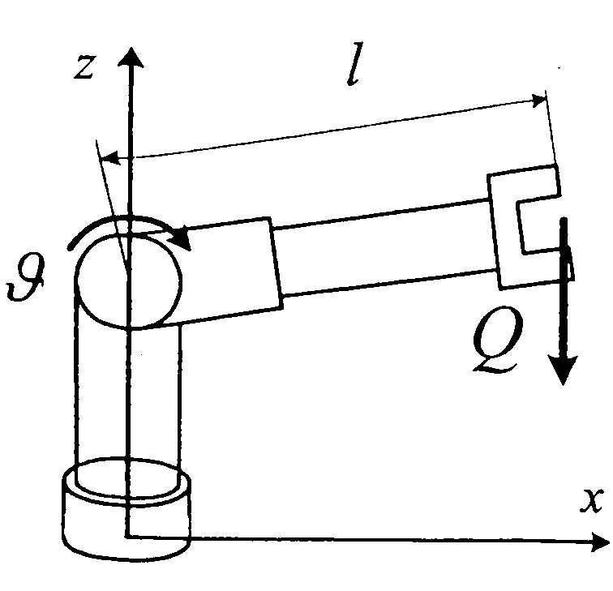

# Morphology

## Problem solved 4

The robot in the figure is actuated by a motor-encoder-reducer assembly. The motor is AC type, whose maximum torque is 1 [Nm], and the maximum speed is 10,000 [rpm]. The gear is a Harmonic Drive type with a reduction ratio of 150:1 and efficiency of 90%. The encoder has 100 lines. The distance between the motor shaft and the end of the robot $l$ is 1 [m].

  * a) Calculate the maximum weight $Q$ that the robot can hold in its end effector.
  * b) Calculate the linear resolution of the movement in the robot's end effector in [mm].
  * c) If the motor runs at maximum velocity, what is the join angular velocity in [deg/s]?
  * d) Find a new encoder for a resolution of 0.01 [mm] in the end effector.

## Solution

### Section a

The pair requested in the worst case is:

$
T_1=Q \cdot l
$

It must be equal and opposite to the torque exerted by the joint.
Therefore:

$
{ Q = T_1/l }
$

Making an energy balance in the joint:

$
\eta = {E_{1} \over E_{m1}} ={ {T_1 \cdot \theta_1} \over {T_{1m} \cdot \theta_{1m}} }; \quad
T_1 = {\theta_{1m} \over \theta_{1}}  \cdot  T_{1m}  \cdot  \eta
$

And replacing the values, it turns out:

$
T_1 = { {150 \over 1} \cdot  1\mathrm{[N \cdot m]}  \cdot  0,90} = 135 \mathrm{[N \cdot m]}
$

Considering the above:
$
{ Q = T_1/l } =
{135 \mathrm{[N \cdot m]} / 1 \mathrm{[m]}}=
135 \mathrm{[N]}
$

The linear resolution of the robot corresponds to the minimum  displacement in the manipulator in the worst case situation. As there is not a position better or worse for that robot, any position is valid for the calculation. For instance, $\theta=0$ will be chosen.

The following figure shows why the linear displacement in the manipulator is calculated as follows:

$
{X_p}={ \sin(\theta_{1}) \cdot L }
$

In the case of the joint, the joint is known to have a 150:1 reduction ratio.
The encoder has 100 beads per turn. Since it is not known whether these counts are pulses or changes in the measurement system, it is assumed that they are changes in the sensor. This means that they can be multiplied by four by quadrature of the signal, then $P_e=4 \cdot 100=400\mathrm{[pulses/turn]}$

Then, the minimum angle at the motor side will be:

$
\theta_{m1p}={6,28\mathrm{[rad]}/400\mathrm{[pulse]} }= { 0,0157 \mathrm{[rad/pulse]} }
$

As $\theta_{1p}=\frac{1}{N_1} \cdot \theta_{m1p}$, it results:

$
{X_p}={ \sin(\frac{1}{N_1} \cdot \theta_{m1p}) \cdot L }
$

And after replacing values, it results:

$
{X_p}={ \sin(\frac{1}{150} \cdot 0,0157 \mathrm{[rad/pulse]}) \cdot 1\mathrm{[m]} }=
{ 0,0001\mathrm{[m]}=0,1\mathrm{[mm]} }
$

It is proposed as an additional exercise to calculate the displacement for circular movement and compare it with the linear displacement of the manipulator.

### Section c

Knowing the transmission ratio of the gear, it can be said that:

$
{ \frac{\dot\theta_{m1}}{\dot\theta_{1}} }={ N_1 }={ {150} };\quad
{ \dot\theta_{1} }={ \frac{\dot\theta_{m1}}{150} }
$

On the other hand, it is known that

$
{\dot\theta_{m1max}}=10000\mathrm{[rpm]} = 
{ 10000\mathrm{[rev/min]} \cdot \frac{360\mathrm{[\deg/rev]}}{60\mathrm{[s/min]}} }=
{60000\mathrm{[\deg/s]}}
$

Then, replacing results in:
$
{ \dot\theta_{1} }={ \frac{60000\mathrm{[\deg/s]}}{150} }=
{400\mathrm{[\deg/s]}}
$

### Section d

Using the reasoning shown in the section b, we can say that:

$
{X_p}={ \sin(\frac{1}{N_1} \cdot \theta_{m1p}) \cdot L }=10^{-5}
$

Rearranging and taking $\arcsin$,

$
\frac{\theta_{m1p}}{N_1} = \arcsin(\frac{10^{-5}}{L}) = 0.000573 \mathrm{[deg]}
$

and then,

$
\theta_{m1p} = N_1 \cdot 0.000573 = 0.086 \mathrm{[deg]}
$

Therefore, we need to send a pulse when the angle changes $\theta_{m1p}$, which in a complete turn makes the following number of pulses:

$
\frac{360 \mathrm{[deg/turn]}} {\theta_{m1p}\mathrm{[deg/pulse]}} = 4186.04 \mathrm{[pulses/turn]}
$

Using a quadrature encoder, we have four pulses per line, therefore, the number of lines are the pulses divided by four, then:

$
\frac{4186.04 \mathrm{[pulses/turn]}}{4 \mathrm{[pulses/line]}} = 1046.5 \mathrm{[lines/turn]} \approx 1047 \mathrm{\quad lines}
$

