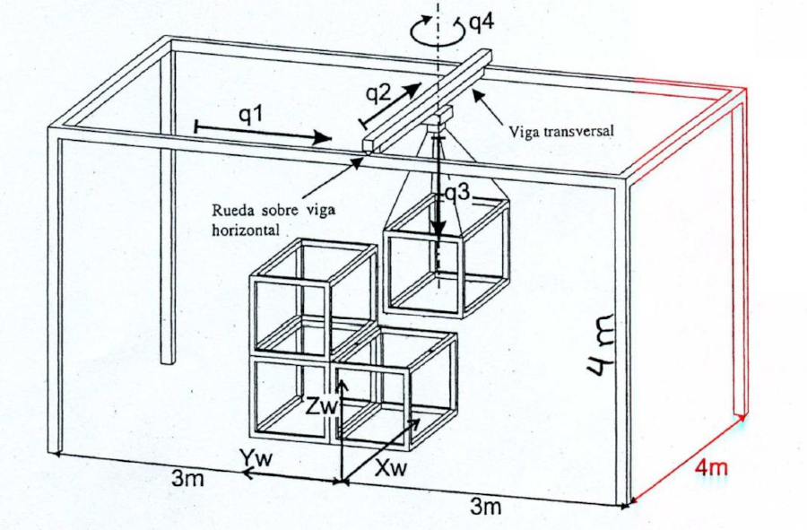
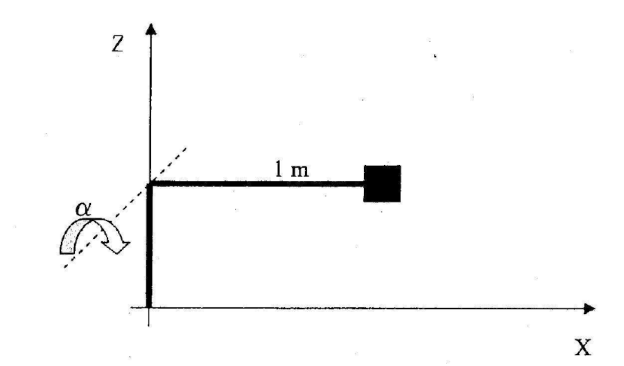

# Morphology

-------------------------------------------
## Problem 3

Consider the 2 DOF ($\theta_1$ and $\theta_2$) robot in the figure. Design the necessary actuators and sensors. These are composed, in each axis, by a DC motor with encoder and a gear. Calculate:

1. The required gear transmission ratio, given that:
     * The maximum motor velocity is $\dot\theta_{mi}=6000 \text{[rpm]}$.
     * The maximum trajectory speed at the robot's end effector is $V_{max}=3000 \text{[mm/sec]}$ when moving each motor separately being the other stopped.
2. The resolution required in the encoders to get a total positioning accuracy at the end effector of $0.01 \text{[mm]}$.
3. The maximum weight that the robot hold, if it is known that:
     * The nominal torque of each motor is $T_1=T_2=1$N·m.
     * The gear efficiency is $\eta=80\%$.
-------------------------------------------
## Solution

### Section 1

For both joints, we have that:

$
N_i=\frac{\dot\theta_{mi}}{\dot\theta_i} \rightarrow
\frac{\dot\theta_{mi}}{N_i}=\dot\theta_i
$

On the other hand, the linear velocity at the opposite end of the joint is calculated by the formula of circular motion $V_p=\dot\theta_i \cdot d $, being $d$ the distance between the center of rotation and the point $p$ inside the solid.

Combining the two equations, the following is obtained:

$
V_p=\frac{\dot\theta_{mi}}{N_i} \cdot d \rightarrow
{N_i}={\frac{\dot\theta_{mi}}{V_2} \cdot d}
$

Pay attention to the fact that $d$ refers to the distance from the point $i$ to the rotation axis, so a rotation in $\theta_{1}$ generates linear velocities in all points of the robot, and in particular $V_{ee}$ ( end effector velocity) and $V_2$ (velocity of joint 2).

The worst case for $\theta_1$, is coincident with the maximum value of $d$, and therefore $\theta_{2}=0 \rightarrow d=1.2+2=3.2\text{[m]}$, and the speed at the end effector, $V_{ee}$. In this case:

$
{V_{ee}}={\frac{\dot\theta_{m1}}{N_1} \cdot 3.2} \rightarrow
{N_1}=\frac{\dot\theta_{m1}}{V_{ee}} \cdot 3.2
$

Substituting values, and taking into account that $V_{ee}\le V_{max}=3 \text{[m/s]}$ and that

$
\dot\theta_{m1}=6000 \text{[rpm]}=628.32 \text{[rad/s]}
$

results in:

$
{N_1}=\frac{628.32\text{[rad/s]}}{3 \text{[m/s]}} \cdot 3.2\text{[m]}
=670.21 \approx 670
$

For $\theta_2$, the distance from the farthest point is $d=2\text{[m]}$, and the speed at the end is still $V_{ee}$. using the equation for this case would be:

$
{V_{ee}}={\frac{\dot\theta_{m2}}{N_2} \cdot 2} \rightarrow
{N_2}=\frac{\dot\theta_{m2}}{V_{ee}} \cdot 2
$

Substituting values, and taking into account that $V_{ee}\le V_{max} = 3 \text{[m/s]}$ and that

$\dot\theta_{m2}=6000 \text{[rpm]}=628.32 \text{[rad/s]}$

results:

$
{N_2}=\frac{628.32\text{[rad/s]}}{3 \text{[m/s]}} \cdot 2\text{[m]}
=418.88 \approx 420
$

### Section 2

The minimum detectable angle is called encoder precision, and is defined by the number of pulses per turn ($P_e$) as follows:

$
\alpha_{e}=\frac{360\text{[deg]}}{P_e},
$

where $\alpha_{e}$ represents the angle between two pulses in [deg].

Given that the encoder must be at the motor side:

$
\alpha_{ei}=\theta_{mi}={\theta_i}{N_i}
$

Let's find now the end effector displacement for the given joint angles. The same angle is considered for both joints ($\theta_1 = \theta_2 = \theta$), and given the small displacement required, we can consider that they are tiny angles and use simplifications accordingly.

Given the figure geometry, we can say that total displacement $L$ is:

$
L=L1sin(\theta)+L2sin(2\theta) = L1sin(\theta)+2L2sin(\theta)cos(\theta)
$

As the angles are tiny, $cos(\theta) \approx 1$, and :

$
L=L1sin(\theta)+2L2sin(\theta) = sin(\theta) (L1+2L2)
$

Considering that $cos(\theta) \approx 1$, another approach leading to a same result is:

And for the values in the exercise, which are $L=0.01 \text{[mm]} = 10^{-5} \text{[m]}$, $L1=1.2\text{[m]}$ and $L2=2\text{[m]}$:

$
10^{-5}= \sin(\theta) (5.2) \rightarrow
\theta = \arcsin(\frac{10^{-5}}{5.2})= 0.00011\text{[deg]}
$

Therefore we have $\theta_1 = \theta_2 = 0.00011\text{[deg]}$ Using previous equations:

$
\alpha_{e1}={\theta_1}{N_1}=0.00011\text{[deg]} \cdot 760=0.08\text{[deg]}
$

which results in:

$
P_{e1}=\frac{360\text{[deg]}}{\alpha_{e1}}
=\frac{360\text{[deg]}}{0.08\text{[deg]}}
=4500\text{[pulses]}
$

and considering a quadrature encoder, $4500\text{[pulses]}/4\text{[pulses/slot]}$, resulting in a $1125 \text{[slots]}$ encoder.

$
\alpha_{e2}={\theta_2}{N_2}=0.00011\text{[deg]} \cdot 420= 0.046\text{[deg]}
$

which results in:

$
P_{e2}=\frac{360\text{[deg]}}{\alpha_{e2}}
=\frac{360\text{[deg]}}{0.046\text{[deg]}}
=7826.08\text{[pulses]}
$

and considering a quadrature encoder, $7826.08\text{[pulses]}/4\text{[pulses/slot]}$, resulting in a $1956,5 \rightarrow 1957 \text{[slots]}$ encoder.

### Section 3

To move the joint by means of the motor, the reduction and the performance of the transmission are applied. Dividing the two energy equations, and taking into account that $\eta ={ E \over E_m }={ 0.80 }$ results that:

$
\eta = {E_{1} \over E_{m1}}=
{ {T_1 \cdot \theta_{1}} \over { T_{m1} \cdot \theta_{m1}} } \quad;\quad 
T_{1} = { {T_{m1} \cdot \eta} \cdot {\theta_{m1} \over \theta_{1}} }
$

To solve, the values are replaced:

$
T_{1} = { {1\mathrm{[N \cdot m]} \cdot 0.80} \cdot 670 }=
{536\mathrm{[N \cdot m]}}
$

Because of the system mechanics, the worst case position is the one shown in the following figure:

Therefore the maximum load that the robot can move in the worst case  position is found as follows:

$
T_1={ P \cdot d } \Rightarrow P=T_1/d
$

And replacing:

$
P=\frac {536\text{[N m]}} {3.2\text{[m]}}=
{167.5\text{[N]} \rightarrow 17,09\text{[kg]}}
$

-------------------------------------------
## Problem solved 4

The movement in q1 is performed by two sets (motor + brake +
resolver + reducer + wheel) placed each of them in the edge of the
transversal beam. Both wheels move over the horizontal beams.

The characteristic of each element are:

  * Gear: transmission ratio 49:1, efficiency: 80%
  * Wheel: radius 163 mm.

Solve the following:

1. If the necessary force to move the maximum payload at q1 is 500N, what is the minimum torque that each motor has to produce to move the joint q1, applying a security coefficient of 25%?

2. What is the nominal motor velocity to make the joint move at a linear velocity of 1m/s?

## Solution

### Section 1

The necessary force, considering two motors, one each side of the beam is:

$
F_1=\frac{500\text{[N]} \cdot 1.25}{2} = 312.5\text{[N]}
$

The complete transmission ($N,\eta$) has two ratios and one efficiency to consider. Being the wheel transmission:

$
N_w = \frac{\theta_{1}}{q_1} = \frac{1\text{[rad]}}{0.163 \text{[m]}}=
6,1349\text{[rad/m]}
$

The resulting ratio is:

$
N=\frac{\theta_{m1}}{q_1}=
N_g \cdot N_w= 49 \cdot 6.135\text{[rad/m]} = 300.615 \text{[rad/m]}
$

And the resulting efficiency, neglecting wheel losses, as they are not provided, is $\eta=0.8 \cdot 1 = 0.8$. Making an energy balance in the joint:

$
\eta = {E_{o} \over E_{i}} ={ \frac{F_1 \cdot q_1}{T_{m1} \cdot \theta_{m1}} }; \quad
T_{m1} = \frac{F_1}{\eta \cdot N }
$

And replacing the values, it turns out:

$
T_{m1} = \frac{312.5\text{[N]}}{0.8 \cdot 300.615 \text{[rad/m]}}=
1,299\text{[N m]}
$

### Section 2

Known the transmission ratio: $ N=\frac{\theta_{m1}}{q_1}= 300.615 \text{[rad/m]} $, we can say that:

$
\dot{\theta}_{m1} = \dot{q}_1 N
$

And replacing:

$
\dot{\theta}_{m1}= 1 \text{[m/s]} \cdot 300.615 \text{[rad/m]}
= 300.615 \text{[rad/s]}
$

----------------------

## Problem solved 5

Design the actuation system of the robot of the figure, based on a motor-encoder-gearbox set.

The manufacturing company offers several motors but only two kinds of Harmonic Drive:

1. 1:160, max 127 Nm, 98% efficiency, 280 grams.
2. 1:120, max 102 Nm, 90% efficiency, 280 grams.

The robot must lift $10 \text{[kg]}$ at tip, at $600 \text{[deg/s]}$, with a $0.1 \text{[mm]}$ tip max error. Select which kind of Harmonic Drive is better for the application and justify the selection, based impact on motor characteristics (torque, velocity) and encoder requirements.

## Solution

In order to compare all the characteristics, we must put all the information in a table. The features we seek for that system is to fulfill specifications with the better motor option. Therefore, we need to find the resulting motor torque, velocity, and the needed encoder.

Having a payload of $10 \text{[kg]} \rightarrow 98 \text{[N]}$ and a distance of $1 \text{[m]}$, the torque is:

$
T= 98 \text{[N]} \cdot 1 \text{[m]}  = 98
$

Which is lower than the maximum torque available for both gears, although the first harmonic drive security factor is higher.

About the encoder requirements, the arm length is  $L=1\text{[m]}$ and the tip precision $l=0.1 \text{[mm]} = 10^{-4} \text{[m]}$,then

$
10^{-4}= 1 \cdot \sin(\theta) \rightarrow
\theta = \arcsin(\frac{10^{-4}}{1})= 0,00573\text{[deg]}
$

Therefore we have $\theta = 0.00573\text{[deg]}$ Using previous equations:

### Case 1

Regarding motor torque we have that:

$
\eta = {E_{o} \over E_{i}} ={ \frac{T \cdot \theta}{T_{m1} \cdot \theta_{m1}} }; \rightarrow \quad
T_{m1} = \frac{T}{\eta \cdot N } = \frac{98}{0.98 \cdot 160 }= 0.625 \text{[Nm]}
$

About the encoder we have that:

$
\alpha_{e1}={\theta}{N_1}=0.00573\text{[deg]} \cdot 160
= 0.9168\text{[deg]}
$

which results in:

$
P_{e1}=\frac{360\text{[deg]}}{\alpha_{e1}}
=\frac{360\text{[deg]}}{0.9168\text{[deg]}}
=392.67\text{[pulses]}
$

and considering a quadrature encoder, $392.67\text{[pulses]}/4\text{[pulses/slot]}$, resulting in a $98,16 \rightarrow 100 \text{[slots]}$ encoder.

And the required motor velocity to have a joint velocity of $\dot{\theta_1} = 600 \text{[deg/s]} = 100 \text{[rpm]} $ is

$
\dot{\theta}_{m1} = N_1 \cdot 100 \text{[rpm]} = 16000 \text{[rpm]}
$

### Case 2

Regarding motor torque we have that:

$
\eta = {E_{o} \over E_{i}} ={ \frac{T \cdot \theta}{T_{m2} \cdot \theta_{m2}} }; \rightarrow \quad
T_{m2} = \frac{T}{\eta \cdot N } = \frac{98}{0.9 \cdot 120 }= 0.907 \text{[Nm]}
$

About the encoder we have that:

$
\alpha_{e1}={\theta}{N_2}=0.00573\text{[deg]} \cdot 120
= 0.6876\text{[deg]}
$

which results in:

$
P_{e1}=\frac{360\text{[deg]}}{\alpha_{e1}}
=\frac{360\text{[deg]}}{0.6876\text{[deg]}}
=523.56\text{[pulses]}
$

and considering a quadrature encoder, $523.56\text{[pulses]}/4\text{[pulses/slot]}$, resulting in a $130,89 \rightarrow 131 \text{[slots]}$ encoder.

And the required motor velocity to have a joint velocity of $\dot{\theta_1} = 600 \text{[deg/s]} = 100 \text{[rpm]} $ is

$
\dot{\theta}_{m1} = N_1 \cdot 100 \text{[rpm]} = 12000 \text{[rpm]}
$

The resulting table showing all the vales is:

| Case| Torque [Nm] | Velocity| Enc. slots|
| :-- | :---------: | :------ |:--------- |
| HD 1| 0.625       | 16000   |  100      |
| HD 2| 0.907       | 12000   |  131      |

Given that the only advantage with HD2 is a lower velocity requirement, and HD1 velocity is not much higher, the selection of HD1 is a better option.

